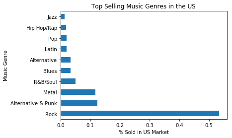
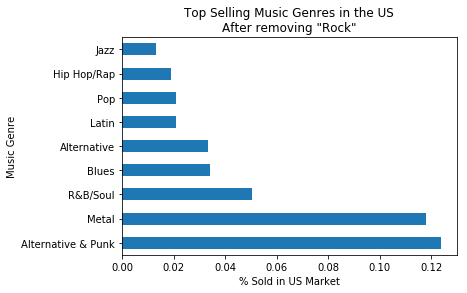
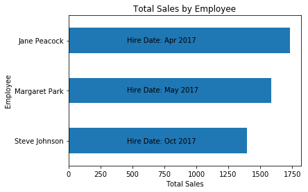

# Solving Business Questions using SQL

## <font color=blue>*chinook* DB Schema</font>


# <font color=blue>Tips for writing complex queries<font>
-  <font color=black>Write your query in stages, and run it as you go to make sure at each stage it's producing the output you expect.</font>
-  <font color=black>If something isn't behaving as you expect, break parts of the query out into their own, separate queries to make sure there's not an inner logic error.</font>
-  <font color=black>Don't be afraid to write separate queries to check the underlying data, for instance you might write a query that you can use to manually check a calculation and give yourself confidence that the output you're seeing is correct.</font>
-  <font color=black>If you do get stuck, don't forget your support options.</font>

### <font color=blue>02 Creating Helper Functions</font>
-  <font color=black>Import the psycopg2, pandas and matplotlib modules, and use the magic command <font color=red>*%matplotlib inline*</font> to make sure any plots render in the notebook.</font>
-  <font color=black>Create a <font color=red>*run_query()*</font> function, that takes a SQL query as an argument and returns a pandas dataframe of that query.</font>
-  <font color=black>Create a <font color=red>*run_command()*</font> function that takes a SQL command as an argument and executes it using the sqlite module.</font>
-  <font color=black>Create a <font color=red>*show_tables()*</font> function that calls the <font color=red>*run_query()*</font> function to return a list of all tables and views in the database.</font>
-  <font color=black>Run the <font color=red>*show_tables()*</font> function.</font>


```python
%matplotlib inline
import psycopg2
import pandas as pd
import numpy as np
import matplotlib.pyplot as plt
from matplotlib import cm
import security as s


# cur = conn.cursor() 
```


```python
def run_query(query):
    with psycopg2.connect(dbname='chinook', user=s.credentials['user'], 
                          host=s.credentials['host'], password=s.credentials['password']) as conn:
        
        return pd.read_sql_query(query, conn)

def run_command(command):
    with psycopg2.connect(dbname='chinook', user=s.credentials['user'], 
                          host=s.credentials['host'], password=s.credentials['password']) as conn:
        
        conn.isolation_level = None # tells PostgreSQL to autocommit any changes
        conn.execute(command)

def show_tables():
    query = "select table_name, table_type from information_schema.tables \
                where table_type = 'BASE TABLE' AND table_schema = 'public';"
    return run_query(query)
    
def show_columns(tablename):
    query =  """select column_name from information_schema.columns where
                table_name='{tn}'""".format(tn = tablename)
    return run_query(query) 

tables = show_tables()
tables
```


<div>
<style>
    .dataframe thead tr:only-child th {
        text-align: right;
    }

    .dataframe thead th {
        text-align: left;
    }

    .dataframe tbody tr th {
        vertical-align: top;
    }
</style>
<table border="1" class="dataframe">
  <thead>
    <tr style="text-align: right;">
      <th></th>
      <th>table_name</th>
      <th>table_type</th>
    </tr>
  </thead>
  <tbody>
    <tr>
      <th>0</th>
      <td>album</td>
      <td>BASE TABLE</td>
    </tr>
    <tr>
      <th>1</th>
      <td>artist</td>
      <td>BASE TABLE</td>
    </tr>
    <tr>
      <th>2</th>
      <td>customer</td>
      <td>BASE TABLE</td>
    </tr>
    <tr>
      <th>3</th>
      <td>employee</td>
      <td>BASE TABLE</td>
    </tr>
    <tr>
      <th>4</th>
      <td>genre</td>
      <td>BASE TABLE</td>
    </tr>
    <tr>
      <th>5</th>
      <td>invoice</td>
      <td>BASE TABLE</td>
    </tr>
    <tr>
      <th>6</th>
      <td>invoice_line</td>
      <td>BASE TABLE</td>
    </tr>
    <tr>
      <th>7</th>
      <td>media_type</td>
      <td>BASE TABLE</td>
    </tr>
    <tr>
      <th>8</th>
      <td>playlist</td>
      <td>BASE TABLE</td>
    </tr>
    <tr>
      <th>9</th>
      <td>playlist_track</td>
      <td>BASE TABLE</td>
    </tr>
    <tr>
      <th>10</th>
      <td>track</td>
      <td>BASE TABLE</td>
    </tr>
  </tbody>
</table>
</div>


### <font color=blue>03 Selecting Albums to Purchase</font>

#### <font color=blue>Primary Question...</font>

The Chinook record store has just signed a deal with a new record label, and you've been tasked with selecting the first three albums that will be added to the store, from a list of four. All four albums are by artists that don't have any tracks in the store right now - we have the artist names, and the genre of music they produce:

| Artist Name | Genre |
| :----- | :----- | 
|Regal| Hip-Hop | 
|Red Tone| Punk |
|Meteor and the Girls | pop |
|ASlim Jim Bites |Blues |

#### <font color=blue>Do the following to answer the question posed above</font>

-  <font color=black>Write a query that returns each genre, with the number of tracks sold in the united states in both absolute numbers and in percentages.  Here's a list strategic of steps taken to generate this query:</font>
-  <font color=black>Create a plot to show this data.</font>
-  <font color=black>Write a paragraph that interprets the data and makes a recommendation for the three artists whose albums we should purchase for the store, based on sales of tracks from their genres.  The table below</font>


```python
query = '''
WITH usa_tracks_sold AS
   (
    SELECT il.* FROM invoice_line il
    INNER JOIN invoice i on il.invoice_id = i.invoice_id
    INNER JOIN customer c on i.customer_id = c.customer_id
    WHERE c.country = 'USA'
   )

SELECT
    g.name genre,
    count(uts.invoice_line_id) tracks_sold,
    cast(count(uts.invoice_line_id) AS FLOAT) / (
        SELECT COUNT(*) from usa_tracks_sold
    ) percentage_sold
FROM usa_tracks_sold uts
INNER JOIN track t on t.track_id = uts.track_id
INNER JOIN genre g on g.genre_id = t.genre_id
GROUP BY 1
ORDER BY 2 DESC
LIMIT 10;
'''
albums_to_purchase = run_query(query)
albums_to_purchase.set_index('genre', inplace=True)

summed = albums_to_purchase.loc['Alternative & Punk','percentage_sold'] + albums_to_purchase.loc['Pop','percentage_sold'] + albums_to_purchase.loc['Blues','percentage_sold']

albums_to_purchase

```


<div>
<style>
    .dataframe thead tr:only-child th {
        text-align: right;
    }

    .dataframe thead th {
        text-align: left;
    }

    .dataframe tbody tr th {
        vertical-align: top;
    }
</style>
<table border="1" class="dataframe">
  <thead>
    <tr style="text-align: right;">
      <th></th>
      <th>tracks_sold</th>
      <th>percentage_sold</th>
    </tr>
    <tr>
      <th>genre</th>
      <th></th>
      <th></th>
    </tr>
  </thead>
  <tbody>
    <tr>
      <th>Rock</th>
      <td>561</td>
      <td>0.533777</td>
    </tr>
    <tr>
      <th>Alternative &amp; Punk</th>
      <td>130</td>
      <td>0.123692</td>
    </tr>
    <tr>
      <th>Metal</th>
      <td>124</td>
      <td>0.117983</td>
    </tr>
    <tr>
      <th>R&amp;B/Soul</th>
      <td>53</td>
      <td>0.050428</td>
    </tr>
    <tr>
      <th>Blues</th>
      <td>36</td>
      <td>0.034253</td>
    </tr>
    <tr>
      <th>Alternative</th>
      <td>35</td>
      <td>0.033302</td>
    </tr>
    <tr>
      <th>Latin</th>
      <td>22</td>
      <td>0.020932</td>
    </tr>
    <tr>
      <th>Pop</th>
      <td>22</td>
      <td>0.020932</td>
    </tr>
    <tr>
      <th>Hip Hop/Rap</th>
      <td>20</td>
      <td>0.019029</td>
    </tr>
    <tr>
      <th>Jazz</th>
      <td>14</td>
      <td>0.013321</td>
    </tr>
  </tbody>
</table>
</div>


```python
ax = albums_to_purchase.plot(kind='barh', y='percentage_sold', title='Top Selling Music Genres in the US')

ax.set_xlabel('% Sold in US Market')
ax.set_ylabel('Music Genre')
ax.legend_.remove()

title='Top Selling Music Genres in the US\nAfter removing "Rock"'
ax = albums_to_purchase.iloc[1:].plot(kind='barh', y='percentage_sold', title=title)
ax.set_xlabel('% Sold in US Market')
ax.set_ylabel('Music Genre')
ax.legend_.remove()

print('The summation of the percentage of the best three choices is', summed)
```

    The summation of the percentage of the best three choices is 0.178877259753








#### <font color=blue>Answer to Primary Question...</font>

| Artist Name | Genre |
| :----- | :----- | 
|Regal| Hip-Hop | 
|Red Tone| Punk |
|Meteor and the Girls | pop |
|ASlim Jim Bites |Blues |

*For reference, the list of artists whose albums I have to choose from are shown above.*

-  Since none of the 4 artists listed produce Rock music (which is the top selling brand in america) the plot above was reproduced without Rock music for rescaling purposes.
-  That being said the following three should be purchased: Red Tone (Punk), Meteor and the Girls (pop), and Aslim JMim Bites (blues)
-  It is worth noting that that none of the three of these are particularly good selections as their genres combined  comprise only ~ 18%.  The top selling genre (rock) makes up ~ 53% of the sales in the us.

# <font color=blue>04 Analyzing Employee Sales Performance</font>

#### <font color=blue>Background</font>

Each customer for the Chinook store gets assigned to a sales support agent within the company when they first make a purchase. You have been asked to analyze the purchases of customers belonging to each employee to see if any sales support agent is performing either better or worse than the others.

You might like to consider whether any extra columns from the employee table explain any variance you see, or whether the variance might instead be indicative of employee performance.


#### <font color=blue>Instructions</font>

-  <font color=black>Write a query that finds the total dollar amount of sales assigned to each sales support agent within the company. Add any extra attributes for that employee that you find are relevant to the analysis.</font>
-  <font color=black>Create a plot of the results of your query</font>
-  <font color=black>Write a short statement describing your results, and providing a possible interpretation.</font>


#### <font color=blue>My Thoughts</font>
-  <font color=black>For each sales agent I will check the following columns for coorleations to performance (total sales):</font>
  -  reports_to
  -  birth_date
  -  hire_date


```python
query = '''
WITH emp_per AS (
    SELECT 
        e.first_name || ' ' || e.last_name Employee,
        e.reports_to Superior,
        e.birthdate birth_date,
        e.hire_date hire_date,
        SUM(i.total) Total_Sales
    FROM employee e
    INNER JOIN customer c ON c.support_rep_id = e.employee_id
    INNER JOIN invoice i ON i.customer_id = c.customer_id
    GROUP BY e.employee_id
    ORDER BY Total_Sales DESC)
    
SELECT
    ep.Employee,
    e.first_name || ' ' || e.last_name Superior,
    ep.birth_date,
    ep.hire_date,
    ep.Total_Sales
FROM emp_per ep
INNER JOIN employee e ON e.employee_id = ep.Superior;
'''
employee_performance = run_query(query)
employee_performance.set_index('employee', inplace=True)
employee_performance
```


<div>
<style>
    .dataframe thead tr:only-child th {
        text-align: right;
    }

    .dataframe thead th {
        text-align: left;
    }

    .dataframe tbody tr th {
        vertical-align: top;
    }
</style>
<table border="1" class="dataframe">
  <thead>
    <tr style="text-align: right;">
      <th></th>
      <th>superior</th>
      <th>birth_date</th>
      <th>hire_date</th>
      <th>total_sales</th>
    </tr>
    <tr>
      <th>employee</th>
      <th></th>
      <th></th>
      <th></th>
      <th></th>
    </tr>
  </thead>
  <tbody>
    <tr>
      <th>Steve Johnson</th>
      <td>Nancy Edwards</td>
      <td>1965-03-03</td>
      <td>2017-10-17</td>
      <td>1393.92</td>
    </tr>
    <tr>
      <th>Margaret Park</th>
      <td>Nancy Edwards</td>
      <td>1947-09-19</td>
      <td>2017-05-03</td>
      <td>1584.00</td>
    </tr>
    <tr>
      <th>Jane Peacock</th>
      <td>Nancy Edwards</td>
      <td>1973-08-29</td>
      <td>2017-04-01</td>
      <td>1731.51</td>
    </tr>
  </tbody>
</table>
</div>


```python
ax = employee_performance.plot(kind='barh', y='total_sales', title='Total Sales by Employee')

ax.set_xlabel('Total Sales')
ax.set_ylabel('Employee')
ax.legend_.remove()
    
ax.annotate('Hire Date: Oct 2017', xy=(0.25, 0.15), xycoords='axes fraction')
ax.annotate('Hire Date: May 2017', xy=(0.25, 0.49), xycoords='axes fraction')
ax.annotate('Hire Date: Apr 2017', xy=(0.25, 0.82), xycoords='axes fraction')
```


    <matplotlib.text.Annotation at 0x7fec939c3ef0>





#### <font color=blue>Answer to Question...</font>

It appers that the difference in sales relates to their hire date.

# <font color=blue>05 Analyzing Sales By Country</font>

-  Write a named sub-query (country_sales_info), another name for the resulting table is result-set, that collates data on purchases from different countries. For each country, include:
  *  __country__ customer.country *Country_Full_List*
  *  __total number of customers__ (COUNT(customer.customer_id) result-set/sub-query: CustomerCountByCountry_Info) *Customer_Count*
  *  __total value of sales__ (SUM(invoice.total)) *Total_Sales*
  *  __average order value__ AVG(invoice.total WHERE country = bla result-set/sub-query: AvgOrderValueByCountry_Info) *AveOrder*
  *  __average value of sales per customer__: Ideas (*AveSalesPerCustomer*)
    1.  SUM(invoice.total)/count customers from given country query 
    1.  AVG(total sales per customer per country result-set/sub-query: AvgSalesPerCustomer_Info) __WinnerWinnerChickenDinner__
    

-  Where a country has only one customer, collect them into an "Other" group.
  *  Use the Case statement to generate a new column that handles this, *Country*
  *  Query the country_sales_info result-set and include all of the following columns:
    1.  *Country*  
    1.  *Customer_Count*
    1.  *Total_Sales*  
    1.  *AveSalesPerCustomer*
    1.  *AveOrder*

-  The results should be sorted by the *Total_Sales* from highest to lowest, with the "Other" group at the very bottom.


```python
query = '''
WITH
    CustomerCountByCountry_Info AS 
        (
            SELECT
                c.country country,
                COUNT(c.customer_id) Customer_Count
            FROM customer c
            GROUP BY country
        ),
  
    LifeTimeSalesPerCustomer_Info AS 
        (
            SELECT 
                c.country country,
                SUM(i.total) LifeTimeCustomerSales
            FROM customer c
            INNER JOIN invoice i ON i.customer_id = c.customer_id
            GROUP BY c.customer_id
        ),

    LifeTimeSalesPerCustomerPerCountry_Info AS 
        (
            SELECT 
                LifeTimeSalesPerCustomer_Info.country country,
                AVG(LifeTimeSalesPerCustomer_Info.LifeTimeCustomerSales) LifeTimeCustomerSales
            FROM LifeTimeSalesPerCustomer_Info 
            GROUP BY 1
        ),
    OrdersByCountry_Info AS 
        (
            SELECT
                c.country country,
                AVG(i.total) Avg_OrderValue,
                SUM(i.total) Tot_OrderValue
            FROM invoice i
            INNER JOIN customer c ON c.customer_id = i.customer_id
            GROUP BY 1
        ), 
    country_sales_info AS
        (
            SELECT
                DISTINCT c.country as Country_Full_List,
                
                (SELECT CustomerCountByCountry_Info.Customer_Count 
                FROM CustomerCountByCountry_Info 
                WHERE c.country = CustomerCountByCountry_Info.country) Customer_Count,
                
                (SELECT OrdersByCountry_Info.Tot_OrderValue
                FROM OrdersByCountry_Info
                WHERE c.country = OrdersByCountry_Info.country) Total_Sales,
                
                (SELECT OrdersByCountry_Info.Avg_OrderValue
                FROM OrdersByCountry_Info
                WHERE c.country = OrdersByCountry_Info.country) Avg_Order,
                
                (SELECT LifeTimeSalesPerCustomerPerCountry_Info.LifeTimeCustomerSales
                FROM LifeTimeSalesPerCustomerPerCountry_Info
                WHERE c.country = LifeTimeSalesPerCustomerPerCountry_Info.country) customer_lifetime_value
                
            FROM customer c
            INNER JOIN CustomerCountByCountry_Info CCBC ON CCBC.country = c.country
            INNER JOIN OrdersByCountry_Info OBC ON OBC.country = c.country
            INNER JOIN LifeTimeSalesPerCustomerPerCountry_Info LTS ON LTS.country = c.country
        ),
    country_sales_aggregate_info AS
        (
            SELECT 
                CASE
                    WHEN CS.Customer_Count = 1 THEN 'Other'
                    ELSE CS.Country_Full_List
                    END
                    AS Country,
                SUM(CS.Customer_Count) Customer_Count,
                SUM(CS.Total_Sales) Total_Sales,
                AVG(CS.Avg_Order) Avg_Order,
                AVG(CS.customer_lifetime_value) customer_lifetime_value
            FROM country_sales_info CS
            GROUP BY 1
        ),
    rank_total_sales AS
        (
            SELECT 
                CSA.*,
                CASE
                    WHEN CSA.Country = 'Other' THEN 0
                    ELSE CSA.Total_Sales
                    END
                    AS  sort_value
            FROM country_sales_aggregate_info CSA
        )

SELECT 
    Country,
    Customer_Count,
    Total_Sales,
    Avg_Order,
    customer_lifetime_value
FROM rank_total_sales
ORDER BY sort_value DESC;
'''

sales_by_country = run_query(query)
sales_by_country
```


<div>
<style>
    .dataframe thead tr:only-child th {
        text-align: right;
    }

    .dataframe thead th {
        text-align: left;
    }

    .dataframe tbody tr th {
        vertical-align: top;
    }
</style>
<table border="1" class="dataframe">
  <thead>
    <tr style="text-align: right;">
      <th></th>
      <th>country</th>
      <th>customer_count</th>
      <th>total_sales</th>
      <th>avg_order</th>
      <th>customer_lifetime_value</th>
    </tr>
  </thead>
  <tbody>
    <tr>
      <th>0</th>
      <td>USA</td>
      <td>13.0</td>
      <td>1040.49</td>
      <td>7.942672</td>
      <td>80.037692</td>
    </tr>
    <tr>
      <th>1</th>
      <td>Canada</td>
      <td>8.0</td>
      <td>535.59</td>
      <td>7.047237</td>
      <td>66.948750</td>
    </tr>
    <tr>
      <th>2</th>
      <td>Brazil</td>
      <td>5.0</td>
      <td>427.68</td>
      <td>7.011148</td>
      <td>85.536000</td>
    </tr>
    <tr>
      <th>3</th>
      <td>France</td>
      <td>5.0</td>
      <td>389.07</td>
      <td>7.781400</td>
      <td>77.814000</td>
    </tr>
    <tr>
      <th>4</th>
      <td>Germany</td>
      <td>4.0</td>
      <td>334.62</td>
      <td>8.161463</td>
      <td>83.655000</td>
    </tr>
    <tr>
      <th>5</th>
      <td>Czech Republic</td>
      <td>2.0</td>
      <td>273.24</td>
      <td>9.108000</td>
      <td>136.620000</td>
    </tr>
    <tr>
      <th>6</th>
      <td>United Kingdom</td>
      <td>3.0</td>
      <td>245.52</td>
      <td>8.768571</td>
      <td>81.840000</td>
    </tr>
    <tr>
      <th>7</th>
      <td>Portugal</td>
      <td>2.0</td>
      <td>185.13</td>
      <td>6.383793</td>
      <td>92.565000</td>
    </tr>
    <tr>
      <th>8</th>
      <td>India</td>
      <td>2.0</td>
      <td>183.15</td>
      <td>8.721429</td>
      <td>91.575000</td>
    </tr>
    <tr>
      <th>9</th>
      <td>Other</td>
      <td>15.0</td>
      <td>1094.94</td>
      <td>7.445071</td>
      <td>72.996000</td>
    </tr>
  </tbody>
</table>
</div>


# <font color=blue>06 Visualizing Sales by Country</font>
  -  For each dimension, create a visualization which demonstrates the data we collated in the previous step.
    -  You should decide whether the "Other" group is relevant to your analysis and make decisions on where to include it (if anywhere) in your visualizations.
  -  Write a few sentences interpreting your data and visualizations, and make one or more recommendations to the marketing team on which countries have potential for growth.


```python
sales_by_country.set_index('country', inplace=True)
colors = [plt.cm.Accent(i) for i in np.linspace(0, 1, sales_by_country.shape[0])]


```

    [(0.49803921568627452, 0.78823529411764703, 0.49803921568627452, 1.0), (0.49803921568627452, 0.78823529411764703, 0.49803921568627452, 1.0), (0.74509803921568629, 0.68235294117647061, 0.83137254901960789, 1.0), (0.99215686274509807, 0.75294117647058822, 0.52549019607843139, 1.0), (1.0, 1.0, 0.59999999999999998, 1.0), (0.2196078431372549, 0.42352941176470588, 0.69019607843137254, 1.0), (0.94117647058823528, 0.0078431372549019607, 0.49803921568627452, 1.0), (0.74901960784313726, 0.35686274509803922, 0.090196078431372534, 1.0), (0.40000000000000002, 0.40000000000000002, 0.40000000000000002, 1.0), (0.40000000000000002, 0.40000000000000002, 0.40000000000000002, 1.0)]

