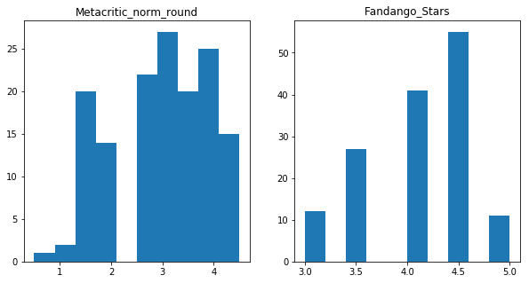

## <font color=blue>01 Movie Reviews</font>
*  Read __fandango_score_comparison.csv__ into a Dataframe named __movies__.
*  Display the __movies__ DataFrame by just typing the variable name and running the code cell.
*  If you're unfamiliar with RottenTomatoes, Metacritic, IMDB, or Fandango, visit the websites to get a better handle on their review methodology.


```python
import pandas as pd
movies = pd.read_csv('fandango_score_comparison.csv')
print('fandango_score_comparison columns')
for c in movies.columns:
    print('\t-', c)
```

    fandango_score_comparison columns
    	- FILM
    	- RottenTomatoes
    	- RottenTomatoes_User
    	- Metacritic
    	- Metacritic_User
    	- IMDB
    	- Fandango_Stars
    	- Fandango_Ratingvalue
    	- RT_norm
    	- RT_user_norm
    	- Metacritic_norm
    	- Metacritic_user_nom
    	- IMDB_norm
    	- RT_norm_round
    	- RT_user_norm_round
    	- Metacritic_norm_round
    	- Metacritic_user_norm_round
    	- IMDB_norm_round
    	- Metacritic_user_vote_count
    	- IMDB_user_vote_count
    	- Fandango_votes
    	- Fandango_Difference


## <font color=blue>02 Histograms</font>
*  Enable plotting in Jupyter notebook with __import matplotlib.pyplot as plt__ and run the following magic __%matplotlib inline__.
*  Create a histogram of the __Metacritic_norm_round__ column.
*  Create a histogram of the __Fandango_Stars__ column.
*  Look critically at both histograms, and write up any differences you see in a markdown cell.


```python
%matplotlib inline
import matplotlib.pyplot as plt

fig = plt.figure(figsize=(10,5))
ax1 = fig.add_subplot(1,2,1)
ax2 = fig.add_subplot(1,2,2)

ax1.hist(movies['Metacritic_norm_round'])
ax2.hist(movies['Fandango_Stars'])

ax1.set_title('Metacritic_norm_round')
ax2.set_title('Fandango_Stars')
```


    <matplotlib.text.Text at 0x7f18e1369da0>





#### Data Description
*  The __Metacritic_norm_round__ data set appears to have a normal-ish looking distributation with the majority of movies getting a score betwween 3-4.
*  The __Fandango_Stars__ data set seems a bit odd as there are very few movies with a rating under 4, and no movies what so ever with a rating under 3.  The rating seems a bit skewed to higher values.

## <font color=blue>03 Mean, Median, and Standard Deviation</font>
*  Calculate the mean of both __Fandango_Stars__ and __Metacritic_norm_round__.
*  Calculate the median of both __Fandango_Stars__ and __Metacritic_norm_round__.
*  Calculate the standard deviation of both __Fandango_Stars__ and __Metacritic_norm_round__. You can use the *numpy.std()* method to find this.
*  Print out all the values and look over them.
*  Look at the review methodologies for [Metacritic](http://www.metacritic.com/) and [Fandango](https://www.fandango.com/). You can find the methodologies on their websites, or by using [Google](https://www.google.com/). Do you see any major differences? Write them up in a markdown cell.
*  Write up the differences in numbers in a markdown cell, including the following:
  *  Why would the median for __Metacritic_norm_round__ be lower than the mean, but the median for __Fandango_Stars__ is higher than the mean? Recall that the mean is usually larger than the median when there are a few large values in the data, and lower when there are a few small values.
  *  Why would the standard deviation for __Fandango_Stars__ be much lower than the standard deviation for __Metacritic_norm_round__?
  *  Why would the mean for __Fandango_Stars__ be much higher than the mean for __Metacritic_norm_round__.
