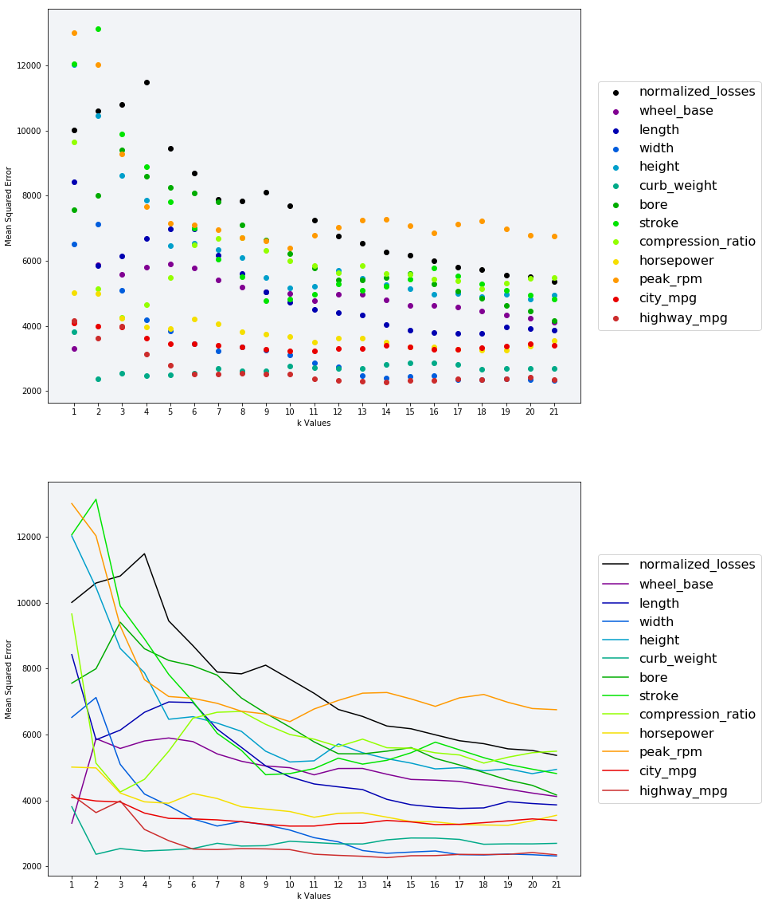
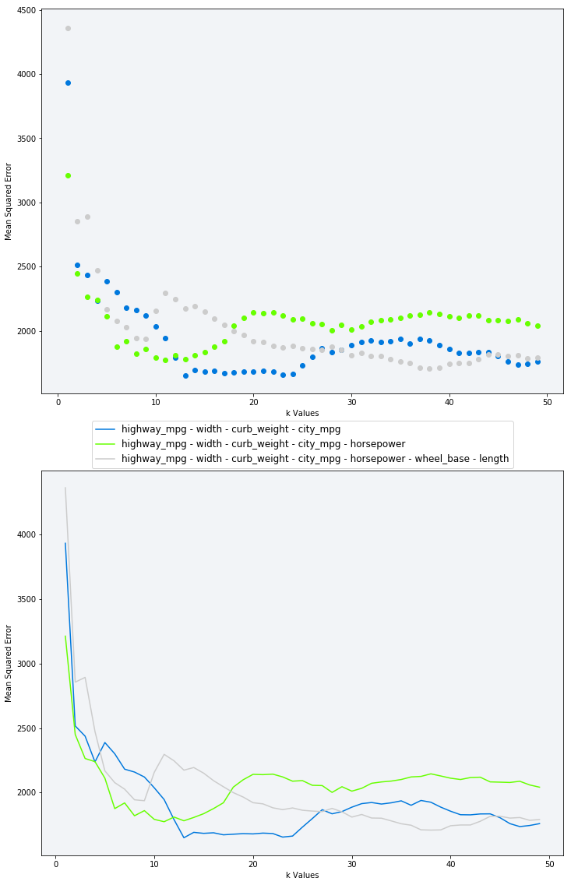

```python
%matplotlib inline
import pandas as pd
import numpy as np
import matplotlib.pyplot as plt
import matplotlib
#from matplotlib.font_manager import FontProperties
```

## <font color=blue>01 Introduction to the data set</font> 
*  Read __imports-85.data__ ([data set description](https://archive.ics.uci.edu/ml/machine-learning-databases/autos/imports-85.names)) into a dataframe named __cars__. If you read in the file using [pandas.read_csv()](https://pandas.pydata.org/pandas-docs/stable/generated/pandas.read_csv.html) without specifying any additional parameter values, you'll notice that the column names don't match the ones in the [dataset's documentation](https://archive.ics.uci.edu/ml/datasets/automobile). Why do you think this is and how can you fix this?
*  Determine which columns are numeric and can be used as features and which column is the target column.
*  Display the first few rows of the dataframe and make sure it looks like the data set preview.


```python
headers=['symboling','normalized_losses','make','fuel_type','aspiration','num_of_doors',
         'body_style','drive_wheels','engine_location','wheel_base','length','width',
        'height','curb_weight','engine_type','num_of_cylinders','engine_size','fuel_system',
        'bore','stroke','compression_ratio','horsepower','peak_rpm','city_mpg','highway_mpg',
        'price']
cars = pd.read_csv('imports-85.data.txt', names=headers)

# Select only the columns with continuous values from - https://archive.ics.uci.edu/ml/machine-learning-databases/autos/imports-85.names
continuous_values_cols = ['normalized_losses', 'wheel_base', 'length', 'width', 'height', 'curb_weight', 'bore', 'stroke', 'compression_ratio', 'horsepower', 'peak_rpm', 'city_mpg', 'highway_mpg', 'price']
numeric_cars = cars[continuous_values_cols].copy()
print(numeric_cars.info())
numeric_cars.head(10)
```

    <class 'pandas.core.frame.DataFrame'>
    RangeIndex: 205 entries, 0 to 204
    Data columns (total 14 columns):
    normalized_losses    205 non-null object
    wheel_base           205 non-null float64
    length               205 non-null float64
    width                205 non-null float64
    height               205 non-null float64
    curb_weight          205 non-null int64
    bore                 205 non-null object
    stroke               205 non-null object
    compression_ratio    205 non-null float64
    horsepower           205 non-null object
    peak_rpm             205 non-null object
    city_mpg             205 non-null int64
    highway_mpg          205 non-null int64
    price                205 non-null object
    dtypes: float64(5), int64(3), object(6)
    memory usage: 22.5+ KB
    None


<div>
<style>
    .dataframe thead tr:only-child th {
        text-align: right;
    }

    .dataframe thead th {
        text-align: left;
    }

    .dataframe tbody tr th {
        vertical-align: top;
    }
</style>
<table border="1" class="dataframe">
  <thead>
    <tr style="text-align: right;">
      <th></th>
      <th>normalized_losses</th>
      <th>wheel_base</th>
      <th>length</th>
      <th>width</th>
      <th>height</th>
      <th>curb_weight</th>
      <th>bore</th>
      <th>stroke</th>
      <th>compression_ratio</th>
      <th>horsepower</th>
      <th>peak_rpm</th>
      <th>city_mpg</th>
      <th>highway_mpg</th>
      <th>price</th>
    </tr>
  </thead>
  <tbody>
    <tr>
      <th>0</th>
      <td>?</td>
      <td>88.6</td>
      <td>168.8</td>
      <td>64.1</td>
      <td>48.8</td>
      <td>2548</td>
      <td>3.47</td>
      <td>2.68</td>
      <td>9.0</td>
      <td>111</td>
      <td>5000</td>
      <td>21</td>
      <td>27</td>
      <td>13495</td>
    </tr>
    <tr>
      <th>1</th>
      <td>?</td>
      <td>88.6</td>
      <td>168.8</td>
      <td>64.1</td>
      <td>48.8</td>
      <td>2548</td>
      <td>3.47</td>
      <td>2.68</td>
      <td>9.0</td>
      <td>111</td>
      <td>5000</td>
      <td>21</td>
      <td>27</td>
      <td>16500</td>
    </tr>
    <tr>
      <th>2</th>
      <td>?</td>
      <td>94.5</td>
      <td>171.2</td>
      <td>65.5</td>
      <td>52.4</td>
      <td>2823</td>
      <td>2.68</td>
      <td>3.47</td>
      <td>9.0</td>
      <td>154</td>
      <td>5000</td>
      <td>19</td>
      <td>26</td>
      <td>16500</td>
    </tr>
    <tr>
      <th>3</th>
      <td>164</td>
      <td>99.8</td>
      <td>176.6</td>
      <td>66.2</td>
      <td>54.3</td>
      <td>2337</td>
      <td>3.19</td>
      <td>3.40</td>
      <td>10.0</td>
      <td>102</td>
      <td>5500</td>
      <td>24</td>
      <td>30</td>
      <td>13950</td>
    </tr>
    <tr>
      <th>4</th>
      <td>164</td>
      <td>99.4</td>
      <td>176.6</td>
      <td>66.4</td>
      <td>54.3</td>
      <td>2824</td>
      <td>3.19</td>
      <td>3.40</td>
      <td>8.0</td>
      <td>115</td>
      <td>5500</td>
      <td>18</td>
      <td>22</td>
      <td>17450</td>
    </tr>
    <tr>
      <th>5</th>
      <td>?</td>
      <td>99.8</td>
      <td>177.3</td>
      <td>66.3</td>
      <td>53.1</td>
      <td>2507</td>
      <td>3.19</td>
      <td>3.40</td>
      <td>8.5</td>
      <td>110</td>
      <td>5500</td>
      <td>19</td>
      <td>25</td>
      <td>15250</td>
    </tr>
    <tr>
      <th>6</th>
      <td>158</td>
      <td>105.8</td>
      <td>192.7</td>
      <td>71.4</td>
      <td>55.7</td>
      <td>2844</td>
      <td>3.19</td>
      <td>3.40</td>
      <td>8.5</td>
      <td>110</td>
      <td>5500</td>
      <td>19</td>
      <td>25</td>
      <td>17710</td>
    </tr>
    <tr>
      <th>7</th>
      <td>?</td>
      <td>105.8</td>
      <td>192.7</td>
      <td>71.4</td>
      <td>55.7</td>
      <td>2954</td>
      <td>3.19</td>
      <td>3.40</td>
      <td>8.5</td>
      <td>110</td>
      <td>5500</td>
      <td>19</td>
      <td>25</td>
      <td>18920</td>
    </tr>
    <tr>
      <th>8</th>
      <td>158</td>
      <td>105.8</td>
      <td>192.7</td>
      <td>71.4</td>
      <td>55.9</td>
      <td>3086</td>
      <td>3.13</td>
      <td>3.40</td>
      <td>8.3</td>
      <td>140</td>
      <td>5500</td>
      <td>17</td>
      <td>20</td>
      <td>23875</td>
    </tr>
    <tr>
      <th>9</th>
      <td>?</td>
      <td>99.5</td>
      <td>178.2</td>
      <td>67.9</td>
      <td>52.0</td>
      <td>3053</td>
      <td>3.13</td>
      <td>3.40</td>
      <td>7.0</td>
      <td>160</td>
      <td>5500</td>
      <td>16</td>
      <td>22</td>
      <td>?</td>
    </tr>
  </tbody>
</table>
</div>


## <font color=blue>02 Data Cleaning</font>
*  Use the [DataFrame.replace()](https://pandas.pydata.org/pandas-docs/stable/generated/pandas.DataFrame.replace.html) method to replace all of the __?__ values with the __numpy.nan__ missing value.
*  Because __?__ is a string value, columns containing this value were cast to the pandas __object__ data type (instead of a numeric type like __int__ or __float__). After replacing the ? values, determine which columns need to be converted to numeric types. You can use either the [DataFrame.astype()](https://pandas.pydata.org/pandas-docs/stable/generated/pandas.DataFrame.astype.html) or the [Series.astype()](https://pandas.pydata.org/pandas-docs/stable/generated/pandas.Series.astype.html) methods to convert column types.
*  Return the number of rows that have a missing value for the __normalized-losses__ column. Determine how you should handle this column. You could:
  *  Replace the missing values using the average values from that column.
  *  Drop the rows entirely (especially if other columns in those rows have missing values).
  *  Drop the column entirely.
*  Explore the missing value counts for the other numeric columns and handle any missing values.
*  Of the columns you decided to keep, normalize the numeric ones so all values range from __0__ to __1__.

### Note...
I struggled quite a bit with this section.  Somehow when I was cleaning my dataset I ended up with 201 entires, 0 to 204.  Which meant I had 3 empty rows *(I think)*; I'm still trying to make sence of it.  Take a look a the cell below with the __FinalDataCheck__ tag.  It resulted in the following exception: __ValueError: Input contains NaN, infinity or a value too large for dtype('float64')__  when I was trying to fit the data.  I was given some great help from the stackoverflow community, see this [thread](https://stackoverflow.com/questions/49042340/valueerror-input-contains-nan-infinity-or-a-value-too-large-for-dtypefloat64).  I believe the problem originated in the __dropna_price__ cell, however, I'm still not positive yet.  The line of code in question is shown here:

> numeric_cars.dropna(subset=['price'], inplace=True)


```python
# Convert missing values (?) with np.NaN then set the type to float
numeric_cars.replace(to_replace='?', value=np.nan, inplace=True)
numeric_cars = numeric_cars.astype('float')
print(numeric_cars.info())
numeric_cars.head(10)
```

    <class 'pandas.core.frame.DataFrame'>
    RangeIndex: 205 entries, 0 to 204
    Data columns (total 14 columns):
    normalized_losses    164 non-null float64
    wheel_base           205 non-null float64
    length               205 non-null float64
    width                205 non-null float64
    height               205 non-null float64
    curb_weight          205 non-null float64
    bore                 201 non-null float64
    stroke               201 non-null float64
    compression_ratio    205 non-null float64
    horsepower           203 non-null float64
    peak_rpm             203 non-null float64
    city_mpg             205 non-null float64
    highway_mpg          205 non-null float64
    price                201 non-null float64
    dtypes: float64(14)
    memory usage: 22.5 KB
    None


<div>
<style>
    .dataframe thead tr:only-child th {
        text-align: right;
    }

    .dataframe thead th {
        text-align: left;
    }

    .dataframe tbody tr th {
        vertical-align: top;
    }
</style>
<table border="1" class="dataframe">
  <thead>
    <tr style="text-align: right;">
      <th></th>
      <th>normalized_losses</th>
      <th>wheel_base</th>
      <th>length</th>
      <th>width</th>
      <th>height</th>
      <th>curb_weight</th>
      <th>bore</th>
      <th>stroke</th>
      <th>compression_ratio</th>
      <th>horsepower</th>
      <th>peak_rpm</th>
      <th>city_mpg</th>
      <th>highway_mpg</th>
      <th>price</th>
    </tr>
  </thead>
  <tbody>
    <tr>
      <th>0</th>
      <td>NaN</td>
      <td>88.6</td>
      <td>168.8</td>
      <td>64.1</td>
      <td>48.8</td>
      <td>2548.0</td>
      <td>3.47</td>
      <td>2.68</td>
      <td>9.0</td>
      <td>111.0</td>
      <td>5000.0</td>
      <td>21.0</td>
      <td>27.0</td>
      <td>13495.0</td>
    </tr>
    <tr>
      <th>1</th>
      <td>NaN</td>
      <td>88.6</td>
      <td>168.8</td>
      <td>64.1</td>
      <td>48.8</td>
      <td>2548.0</td>
      <td>3.47</td>
      <td>2.68</td>
      <td>9.0</td>
      <td>111.0</td>
      <td>5000.0</td>
      <td>21.0</td>
      <td>27.0</td>
      <td>16500.0</td>
    </tr>
    <tr>
      <th>2</th>
      <td>NaN</td>
      <td>94.5</td>
      <td>171.2</td>
      <td>65.5</td>
      <td>52.4</td>
      <td>2823.0</td>
      <td>2.68</td>
      <td>3.47</td>
      <td>9.0</td>
      <td>154.0</td>
      <td>5000.0</td>
      <td>19.0</td>
      <td>26.0</td>
      <td>16500.0</td>
    </tr>
    <tr>
      <th>3</th>
      <td>164.0</td>
      <td>99.8</td>
      <td>176.6</td>
      <td>66.2</td>
      <td>54.3</td>
      <td>2337.0</td>
      <td>3.19</td>
      <td>3.40</td>
      <td>10.0</td>
      <td>102.0</td>
      <td>5500.0</td>
      <td>24.0</td>
      <td>30.0</td>
      <td>13950.0</td>
    </tr>
    <tr>
      <th>4</th>
      <td>164.0</td>
      <td>99.4</td>
      <td>176.6</td>
      <td>66.4</td>
      <td>54.3</td>
      <td>2824.0</td>
      <td>3.19</td>
      <td>3.40</td>
      <td>8.0</td>
      <td>115.0</td>
      <td>5500.0</td>
      <td>18.0</td>
      <td>22.0</td>
      <td>17450.0</td>
    </tr>
    <tr>
      <th>5</th>
      <td>NaN</td>
      <td>99.8</td>
      <td>177.3</td>
      <td>66.3</td>
      <td>53.1</td>
      <td>2507.0</td>
      <td>3.19</td>
      <td>3.40</td>
      <td>8.5</td>
      <td>110.0</td>
      <td>5500.0</td>
      <td>19.0</td>
      <td>25.0</td>
      <td>15250.0</td>
    </tr>
    <tr>
      <th>6</th>
      <td>158.0</td>
      <td>105.8</td>
      <td>192.7</td>
      <td>71.4</td>
      <td>55.7</td>
      <td>2844.0</td>
      <td>3.19</td>
      <td>3.40</td>
      <td>8.5</td>
      <td>110.0</td>
      <td>5500.0</td>
      <td>19.0</td>
      <td>25.0</td>
      <td>17710.0</td>
    </tr>
    <tr>
      <th>7</th>
      <td>NaN</td>
      <td>105.8</td>
      <td>192.7</td>
      <td>71.4</td>
      <td>55.7</td>
      <td>2954.0</td>
      <td>3.19</td>
      <td>3.40</td>
      <td>8.5</td>
      <td>110.0</td>
      <td>5500.0</td>
      <td>19.0</td>
      <td>25.0</td>
      <td>18920.0</td>
    </tr>
    <tr>
      <th>8</th>
      <td>158.0</td>
      <td>105.8</td>
      <td>192.7</td>
      <td>71.4</td>
      <td>55.9</td>
      <td>3086.0</td>
      <td>3.13</td>
      <td>3.40</td>
      <td>8.3</td>
      <td>140.0</td>
      <td>5500.0</td>
      <td>17.0</td>
      <td>20.0</td>
      <td>23875.0</td>
    </tr>
    <tr>
      <th>9</th>
      <td>NaN</td>
      <td>99.5</td>
      <td>178.2</td>
      <td>67.9</td>
      <td>52.0</td>
      <td>3053.0</td>
      <td>3.13</td>
      <td>3.40</td>
      <td>7.0</td>
      <td>160.0</td>
      <td>5500.0</td>
      <td>16.0</td>
      <td>22.0</td>
      <td>NaN</td>
    </tr>
  </tbody>
</table>
</div>


```python
# Show the percentage of values in each column that are not numberic.

not_numeric_count = len(numeric_cars) - numeric_cars.count(axis=0, level=None, numeric_only=False)
percentage_not_numeric = (not_numeric_count / len(numeric_cars)) * 100
percentage_not_numeric
```


    normalized_losses    20.00000
    wheel_base            0.00000
    length                0.00000
    width                 0.00000
    height                0.00000
    curb_weight           0.00000
    bore                  1.95122
    stroke                1.95122
    compression_ratio     0.00000
    horsepower            0.97561
    peak_rpm              0.97561
    city_mpg              0.00000
    highway_mpg           0.00000
    price                 1.95122
    dtype: float64


```python
# Because the column we're trying to predict is 'price', any row were price is NaN will be removed.
# After doing check the DataFrame again
numeric_cars.dropna(subset=['price'], inplace=True)
numeric_cars.info()
```

    <class 'pandas.core.frame.DataFrame'>
    Int64Index: 201 entries, 0 to 204
    Data columns (total 14 columns):
    normalized_losses    164 non-null float64
    wheel_base           201 non-null float64
    length               201 non-null float64
    width                201 non-null float64
    height               201 non-null float64
    curb_weight          201 non-null float64
    bore                 197 non-null float64
    stroke               197 non-null float64
    compression_ratio    201 non-null float64
    horsepower           199 non-null float64
    peak_rpm             199 non-null float64
    city_mpg             201 non-null float64
    highway_mpg          201 non-null float64
    price                201 non-null float64
    dtypes: float64(14)
    memory usage: 23.6 KB


```python
# All remaining NaN's will be filled with the mean of its respective column
# Then, yet again check the DataFrame.

numeric_cars = numeric_cars.fillna(numeric_cars.mean())
numeric_cars.info()
```

    <class 'pandas.core.frame.DataFrame'>
    Int64Index: 201 entries, 0 to 204
    Data columns (total 14 columns):
    normalized_losses    201 non-null float64
    wheel_base           201 non-null float64
    length               201 non-null float64
    width                201 non-null float64
    height               201 non-null float64
    curb_weight          201 non-null float64
    bore                 201 non-null float64
    stroke               201 non-null float64
    compression_ratio    201 non-null float64
    horsepower           201 non-null float64
    peak_rpm             201 non-null float64
    city_mpg             201 non-null float64
    highway_mpg          201 non-null float64
    price                201 non-null float64
    dtypes: float64(14)
    memory usage: 23.6 KB


```python
# Create training feature list and k value list
test_features = numeric_cars.columns.tolist()
predictive_feature = 'price'
test_features.remove(predictive_feature)
# k_values = [x for x in range(22) if x/2 != round(x/2)]
k_values = [x for x in range(1,22)]

# Normalize columns
numeric_cars_normalized = numeric_cars[test_features].copy()
numeric_cars_normalized = (numeric_cars_normalized - numeric_cars_normalized.min()) / (numeric_cars_normalized.max() - numeric_cars_normalized.min())
numeric_cars_normalized[predictive_feature] = numeric_cars[predictive_feature].copy()

numeric_cars_normalized.head(5)
```


<div>
<style>
    .dataframe thead tr:only-child th {
        text-align: right;
    }

    .dataframe thead th {
        text-align: left;
    }

    .dataframe tbody tr th {
        vertical-align: top;
    }
</style>
<table border="1" class="dataframe">
  <thead>
    <tr style="text-align: right;">
      <th></th>
      <th>normalized_losses</th>
      <th>wheel_base</th>
      <th>length</th>
      <th>width</th>
      <th>height</th>
      <th>curb_weight</th>
      <th>bore</th>
      <th>stroke</th>
      <th>compression_ratio</th>
      <th>horsepower</th>
      <th>peak_rpm</th>
      <th>city_mpg</th>
      <th>highway_mpg</th>
      <th>price</th>
    </tr>
  </thead>
  <tbody>
    <tr>
      <th>0</th>
      <td>0.298429</td>
      <td>0.058309</td>
      <td>0.413433</td>
      <td>0.324786</td>
      <td>0.083333</td>
      <td>0.411171</td>
      <td>0.664286</td>
      <td>0.290476</td>
      <td>0.1250</td>
      <td>0.294393</td>
      <td>0.346939</td>
      <td>0.222222</td>
      <td>0.289474</td>
      <td>13495.0</td>
    </tr>
    <tr>
      <th>1</th>
      <td>0.298429</td>
      <td>0.058309</td>
      <td>0.413433</td>
      <td>0.324786</td>
      <td>0.083333</td>
      <td>0.411171</td>
      <td>0.664286</td>
      <td>0.290476</td>
      <td>0.1250</td>
      <td>0.294393</td>
      <td>0.346939</td>
      <td>0.222222</td>
      <td>0.289474</td>
      <td>16500.0</td>
    </tr>
    <tr>
      <th>2</th>
      <td>0.298429</td>
      <td>0.230321</td>
      <td>0.449254</td>
      <td>0.444444</td>
      <td>0.383333</td>
      <td>0.517843</td>
      <td>0.100000</td>
      <td>0.666667</td>
      <td>0.1250</td>
      <td>0.495327</td>
      <td>0.346939</td>
      <td>0.166667</td>
      <td>0.263158</td>
      <td>16500.0</td>
    </tr>
    <tr>
      <th>3</th>
      <td>0.518325</td>
      <td>0.384840</td>
      <td>0.529851</td>
      <td>0.504274</td>
      <td>0.541667</td>
      <td>0.329325</td>
      <td>0.464286</td>
      <td>0.633333</td>
      <td>0.1875</td>
      <td>0.252336</td>
      <td>0.551020</td>
      <td>0.305556</td>
      <td>0.368421</td>
      <td>13950.0</td>
    </tr>
    <tr>
      <th>4</th>
      <td>0.518325</td>
      <td>0.373178</td>
      <td>0.529851</td>
      <td>0.521368</td>
      <td>0.541667</td>
      <td>0.518231</td>
      <td>0.464286</td>
      <td>0.633333</td>
      <td>0.0625</td>
      <td>0.313084</td>
      <td>0.551020</td>
      <td>0.138889</td>
      <td>0.157895</td>
      <td>17450.0</td>
    </tr>
  </tbody>
</table>
</div>


```python
# Do a final check on the data and verify that it has been cleaned properly and there are no NaN's or inf

index = []
NaN_counter = []
inf_counter = []

for col in numeric_cars_normalized.columns:
    index.append(col)
    inf_counter.append(np.any(np.isfinite(numeric_cars_normalized[col])))
    NaN_counter.append(np.any(np.isnan(numeric_cars_normalized[col])))
 
data_check = {'Any_NaN': NaN_counter, 'Any_inf': inf_counter}
data_verification = pd.DataFrame(data=data_check, index=index)

print(numeric_cars_normalized.info())
data_verification
```

    <class 'pandas.core.frame.DataFrame'>
    Int64Index: 201 entries, 0 to 204
    Data columns (total 14 columns):
    normalized_losses    201 non-null float64
    wheel_base           201 non-null float64
    length               201 non-null float64
    width                201 non-null float64
    height               201 non-null float64
    curb_weight          201 non-null float64
    bore                 201 non-null float64
    stroke               201 non-null float64
    compression_ratio    201 non-null float64
    horsepower           201 non-null float64
    peak_rpm             201 non-null float64
    city_mpg             201 non-null float64
    highway_mpg          201 non-null float64
    price                201 non-null float64
    dtypes: float64(14)
    memory usage: 23.6 KB
    None


<div>
<style>
    .dataframe thead tr:only-child th {
        text-align: right;
    }

    .dataframe thead th {
        text-align: left;
    }

    .dataframe tbody tr th {
        vertical-align: top;
    }
</style>
<table border="1" class="dataframe">
  <thead>
    <tr style="text-align: right;">
      <th></th>
      <th>Any_NaN</th>
      <th>Any_inf</th>
    </tr>
  </thead>
  <tbody>
    <tr>
      <th>normalized_losses</th>
      <td>False</td>
      <td>True</td>
    </tr>
    <tr>
      <th>wheel_base</th>
      <td>False</td>
      <td>True</td>
    </tr>
    <tr>
      <th>length</th>
      <td>False</td>
      <td>True</td>
    </tr>
    <tr>
      <th>width</th>
      <td>False</td>
      <td>True</td>
    </tr>
    <tr>
      <th>height</th>
      <td>False</td>
      <td>True</td>
    </tr>
    <tr>
      <th>curb_weight</th>
      <td>False</td>
      <td>True</td>
    </tr>
    <tr>
      <th>bore</th>
      <td>False</td>
      <td>True</td>
    </tr>
    <tr>
      <th>stroke</th>
      <td>False</td>
      <td>True</td>
    </tr>
    <tr>
      <th>compression_ratio</th>
      <td>False</td>
      <td>True</td>
    </tr>
    <tr>
      <th>horsepower</th>
      <td>False</td>
      <td>True</td>
    </tr>
    <tr>
      <th>peak_rpm</th>
      <td>False</td>
      <td>True</td>
    </tr>
    <tr>
      <th>city_mpg</th>
      <td>False</td>
      <td>True</td>
    </tr>
    <tr>
      <th>highway_mpg</th>
      <td>False</td>
      <td>True</td>
    </tr>
    <tr>
      <th>price</th>
      <td>False</td>
      <td>True</td>
    </tr>
  </tbody>
</table>
</div>


## <font color=blue>03 Univariate Model</font>
*  Create a function, named __knn_train_test()__ that encapsulates the training and simple validation process. This function should have 3 parameters -- training column name, target column name, and the dataframe object.
  *  This function should split the data set into a training and test set.
  *  Then, it should instantiate the KNeighborsRegressor class, fit the model on the training set, and make predictions on the test set.
  *  Finally, it should calculate the RMSE and return that value.
*  Use this function to train and test univariate models using the different numeric columns in the data set. Which column performed the best using the default __k__ value?
*  Modify the __knn_train_test()__ function you wrote to accept a parameter for the __k__ value.
  *  Update the function logic to use this parameter.
  *  For each numeric column, create, train, and test a univariate model using the following __k__ values (__1 - 21__). Visualize the results using a scatter plot and a line plot.


```python
from sklearn.neighbors import KNeighborsRegressor
from sklearn.metrics import mean_squared_error

def knn_train_test_Univariate(df, train_columns, predict_column, k_value):
    # Randomly resorts the DataFrame to mitiate sampling bias
    # np.random.seed(1)
    # df = df.loc[np.random.permutation(len(df))]

    # Split the DataFrame into ~75% train / 25% test data sets
    split_integer = round(len(df) * 0.75)
    train_df = df.iloc[0:split_integer]
    test_df = df.iloc[split_integer:]
    
    train_features = train_df[train_columns].values.reshape(-1, 1)
    train_target = train_df[predict_column].values.reshape(-1, 1)
    test_features = test_df[train_columns].values.reshape(-1, 1)
    
    # Trains the model
    knn = KNeighborsRegressor(n_neighbors=k_value)
    knn.fit(train_features, train_target)
    
    # Test the model & return calculate mean square error
    predictions = knn.predict(test_features)
    mse = mean_squared_error(y_true=test_df[predict_column], y_pred=predictions)
    return mse ** 0.5

def knn_train_test_Mulitvariate_Model(df, train_columns, predict_column, k_value):
    # Randomly resorts the DataFrame to mitiate sampling bias
    # np.random.seed(1)
    # df = df.loc[np.random.permutation(len(df))]

    # Split the DataFrame into ~75% train / 25% test data sets
    split_integer = round(len(df) * 0.75)
    train_df = df.iloc[0:split_integer]
    test_df = df.iloc[split_integer:]
    
    train_features = train_df[train_columns].values
    train_target = train_df[predict_column].values
    test_features = test_df[train_columns].values
    
    # Trains the model
    knn = KNeighborsRegressor(n_neighbors=k_value)
    knn.fit(train_features, train_target)
    
    # Test the model & return calculate mean square error
    predictions = knn.predict(test_features)
    mse = mean_squared_error(y_true=test_df[predict_column], y_pred=predictions)
    return mse ** 0.5
```


```python
# instantiate mse dict
rmse_dict = {}

for feature in test_features:
    # instantiate mse list
    rmse = []
    
    for k_value in k_values:
        rmse.append(knn_train_test_Univariate(df=numeric_cars_normalized, train_columns=feature, 
                    predict_column=predictive_feature, k_value=k_value))
        
    rmse_dict[feature] = rmse
```


```python
matplotlib.rc('legend', fontsize=16)
fig = plt.figure(figsize=(12,20))
ax1 = fig.add_subplot(2,1,1)
ax2 = fig.add_subplot(2,1,2)

ax1.set_prop_cycle('color',plt.cm.spectral(np.linspace(0,1.6,21)))
ax2.set_prop_cycle('color',plt.cm.spectral(np.linspace(0,1.6,21)))

for i, feature in enumerate(test_features):
    ax1.scatter(x=k_values, y=rmse_dict[feature], label=feature)
    ax2.plot(k_values, rmse_dict[feature], label=feature)
    
ax1.legend(loc='center right', bbox_to_anchor=(1.35, 0.5))
ax1.set_xlabel('k Values')
ax1.set_ylabel('Mean Squared Error') 
ax1.set_xticks(k_values)
ax1.set_facecolor("#f2f4f7")

ax2.legend(loc='center right', bbox_to_anchor=(1.35, 0.5))
ax2.set_xlabel('k Values')
ax2.set_ylabel('Mean Squared Error') 
ax2.set_xticks(k_values)
ax2.set_facecolor("#f2f4f7")

plt.show()
```





## <font color=blue>04 Mulitvariate Model</font>
*  Modify the __knn_train_test()__ function to accept a list of column names (instead of just a string). Modify the rest of the function logic to use this parameter:
  *  Instead of using just a single column for train and test, use all of the columns passed in.
  *  Use a the default k value from scikit-learn for now (we'll tune the k value in the next step).
*  Use the best 2 features from the previous step to train and test a multivariate k-nearest neighbors model using the default __k__ value.
*  Use the best 3 features from the previous step to train and test a multivariate k-nearest neighbors model using the default __k__ value.
*  Use the best 4 features from the previous step to train and test a multivariate k-nearest neighbors model using the default __k__ value.
*  Use the best 5 features from the previous step to train and test a multivariate k-nearest neighbors model using the default __k__ value.
  *  *Note, I've decided to take this out to the best 8 training features.*
*  Display all of the RMSE values.


```python
# Test knn_train_test() using all of the test features and a k value of 5
rmse = knn_train_test_Mulitvariate_Model(df=numeric_cars_normalized, train_columns=test_features, 
                    predict_column=predictive_feature, k_value=5)
print('All test features rmse:', rmse)
```

    All test features rmse: 3116.75273373


```python
# Rank the test features by mean mse values from the plots above
rmse_by_feature = pd.DataFrame(data=rmse_dict)
rmse_mean_by_feature = rmse_by_feature.mean()
rmse_mean_by_feature.sort_values(inplace=True)
print('\t-mean rmse rankings-')
rmse_mean_by_feature
```

    	-mean rmse rankings-


    highway_mpg          2669.201462
    curb_weight          2717.126422
    width                3346.691129
    city_mpg             3449.845059
    horsepower           3771.036743
    wheel_base           4922.771468
    length               5084.762585
    compression_ratio    5815.033389
    height               6257.991195
    bore                 6373.415510
    stroke               6545.805382
    normalized_losses    7597.870540
    peak_rpm             7621.733891
    dtype: float64


```python
# Just becasue I'm curious I'm going to get the min() RMSE for each feature
# I want to see how closely it coorelates to the ranking above
rmse_min_by_feature = rmse_by_feature.min()
rmse_min_by_feature.sort_values(inplace=True)
print('\t-min rmse rankings-')
rmse_min_by_feature
```

    	-min rmse rankings-


    highway_mpg          2263.956326
    width                2313.414022
    curb_weight          2365.314259
    city_mpg             3220.669291
    horsepower           3244.590305
    wheel_base           3308.012319
    length               3757.771477
    bore                 4164.494998
    compression_ratio    4255.456074
    stroke               4779.864505
    height               4812.267536
    normalized_losses    5367.236491
    peak_rpm             6390.887983
    dtype: float64


#### Training Features Ranked By RMSE
The training features have been ranked both by mean() & min() RMSE values.  It is interesting to see that the top 5 five features are the same via both ranking methods.  The exact sequence of the top five varies a bit.  As a result the next step will be duplicated for both top 5 rankings.  The top 3 modles that yields the lowest RMSQ will be used in the next evaluation.


```python
# Use the best 2, 3, ... 8 features from the mean ranking step to train and 
# test a multivariate k-nearest neighbors model using the default k value (5).
# Then display all of the RMSE values.

print('**Training Set Evalution using the min rankings**\n')

training_features_lst = []
RMSE = []
feature_count = []
for i, n in enumerate(range(2,9)):
    feature_count.append(n)
    training_features = rmse_min_by_feature.index[:n].tolist()
    training_features_lst.append(' - '.join(training_features))
    RMSE.append(knn_train_test_Mulitvariate_Model(df=numeric_cars_normalized, train_columns=training_features, 
                    predict_column=predictive_feature, k_value=5))
    
min_ranking_eval_set = pd.DataFrame({'feature_cnt': feature_count, 'features': training_features_lst, 'RMSE': RMSE})
min_ranking_eval_set.sort_values('RMSE', inplace=True)
min_ranking_eval_set
```

    **Training Set Evalution using the min rankings**
    


<div>
<style>
    .dataframe thead tr:only-child th {
        text-align: right;
    }

    .dataframe thead th {
        text-align: left;
    }

    .dataframe tbody tr th {
        vertical-align: top;
    }
</style>
<table border="1" class="dataframe">
  <thead>
    <tr style="text-align: right;">
      <th></th>
      <th>RMSE</th>
      <th>feature_cnt</th>
      <th>features</th>
    </tr>
  </thead>
  <tbody>
    <tr>
      <th>3</th>
      <td>2111.971270</td>
      <td>5</td>
      <td>highway_mpg - width - curb_weight - city_mpg -...</td>
    </tr>
    <tr>
      <th>5</th>
      <td>2168.278086</td>
      <td>7</td>
      <td>highway_mpg - width - curb_weight - city_mpg -...</td>
    </tr>
    <tr>
      <th>2</th>
      <td>2387.680343</td>
      <td>4</td>
      <td>highway_mpg - width - curb_weight - city_mpg</td>
    </tr>
    <tr>
      <th>6</th>
      <td>2589.092501</td>
      <td>8</td>
      <td>highway_mpg - width - curb_weight - city_mpg -...</td>
    </tr>
    <tr>
      <th>1</th>
      <td>2677.704705</td>
      <td>3</td>
      <td>highway_mpg - width - curb_weight</td>
    </tr>
    <tr>
      <th>4</th>
      <td>2686.937684</td>
      <td>6</td>
      <td>highway_mpg - width - curb_weight - city_mpg -...</td>
    </tr>
    <tr>
      <th>0</th>
      <td>2831.602905</td>
      <td>2</td>
      <td>highway_mpg - width</td>
    </tr>
  </tbody>
</table>
</div>


```python
# Use the best 2, 3, ... 8 features from the mean ranking step to train and 
# test a multivariate k-nearest neighbors model using the default k value (5).
# Then display all of the RMSE values.

print('**Training Set Evalution using the mean rankings**\n')
feature_count = []
training_features_lst = []
RMSE = []
for i, n in enumerate(range(2,9)):
    feature_count.append(n)
    training_features = rmse_mean_by_feature.index[:n].tolist()
    training_features_lst.append(' - '.join(training_features))
    RMSE.append(knn_train_test_Mulitvariate_Model(df=numeric_cars_normalized, train_columns=training_features, 
                    predict_column=predictive_feature, k_value=5))
    
mean_ranking_eval_set = pd.DataFrame({'feature_cnt': feature_count, 'features': training_features_lst, 'RMSE': RMSE})
mean_ranking_eval_set.sort_values('RMSE', inplace=True)
mean_ranking_eval_set
```

    **Training Set Evalution using the mean rankings**
    


<div>
<style>
    .dataframe thead tr:only-child th {
        text-align: right;
    }

    .dataframe thead th {
        text-align: left;
    }

    .dataframe tbody tr th {
        vertical-align: top;
    }
</style>
<table border="1" class="dataframe">
  <thead>
    <tr style="text-align: right;">
      <th></th>
      <th>RMSE</th>
      <th>feature_cnt</th>
      <th>features</th>
    </tr>
  </thead>
  <tbody>
    <tr>
      <th>3</th>
      <td>2111.971270</td>
      <td>5</td>
      <td>highway_mpg - curb_weight - width - city_mpg -...</td>
    </tr>
    <tr>
      <th>5</th>
      <td>2168.278086</td>
      <td>7</td>
      <td>highway_mpg - curb_weight - width - city_mpg -...</td>
    </tr>
    <tr>
      <th>2</th>
      <td>2387.680343</td>
      <td>4</td>
      <td>highway_mpg - curb_weight - width - city_mpg</td>
    </tr>
    <tr>
      <th>1</th>
      <td>2677.704705</td>
      <td>3</td>
      <td>highway_mpg - curb_weight - width</td>
    </tr>
    <tr>
      <th>4</th>
      <td>2686.937684</td>
      <td>6</td>
      <td>highway_mpg - curb_weight - width - city_mpg -...</td>
    </tr>
    <tr>
      <th>6</th>
      <td>2867.916076</td>
      <td>8</td>
      <td>highway_mpg - curb_weight - width - city_mpg -...</td>
    </tr>
    <tr>
      <th>0</th>
      <td>3100.238248</td>
      <td>2</td>
      <td>highway_mpg - curb_weight</td>
    </tr>
  </tbody>
</table>
</div>


## <font color=blue>05 Hyperparameter Tuning</font>
*  For the top 3 models in the last step, vary the hyperparameter value from __1__ to __25__ and plot the resulting RMSE values.
*  Which __k__ value is optimal for each model? How different are the __k__ values and what do you think accounts for the differences?


```python
# Optimize the hyperparameter (k) for the top 3 models

rmse_dict = {}

for n in range(3):
    feature_cnt = min_ranking_eval_set.iloc[n]['feature_cnt']
    features = rmse_min_by_feature.index[:feature_cnt].tolist()
    # instantiate mse list
    rmse = []
    
    for k_value in range(1,50):
        rmse.append(knn_train_test_Mulitvariate_Model(df=numeric_cars_normalized, train_columns=features, 
                    predict_column=predictive_feature, k_value=k_value))
        
    rmse_dict[min_ranking_eval_set.iloc[n]['features']] = rmse
```


```python
rmse_by_feature = pd.DataFrame(data=rmse_dict)
rmse_by_feature['k_value'] = [x for x in range(1,50)]
rmse_by_feature.head(5)
```


<div>
<style>
    .dataframe thead tr:only-child th {
        text-align: right;
    }

    .dataframe thead th {
        text-align: left;
    }

    .dataframe tbody tr th {
        vertical-align: top;
    }
</style>
<table border="1" class="dataframe">
  <thead>
    <tr style="text-align: right;">
      <th></th>
      <th>highway_mpg - width - curb_weight - city_mpg</th>
      <th>highway_mpg - width - curb_weight - city_mpg - horsepower</th>
      <th>highway_mpg - width - curb_weight - city_mpg - horsepower - wheel_base - length</th>
      <th>k_value</th>
    </tr>
  </thead>
  <tbody>
    <tr>
      <th>0</th>
      <td>3931.177516</td>
      <td>3211.735444</td>
      <td>4360.884465</td>
      <td>1</td>
    </tr>
    <tr>
      <th>1</th>
      <td>2516.293721</td>
      <td>2450.036975</td>
      <td>2855.418142</td>
      <td>2</td>
    </tr>
    <tr>
      <th>2</th>
      <td>2437.036419</td>
      <td>2263.953969</td>
      <td>2892.166093</td>
      <td>3</td>
    </tr>
    <tr>
      <th>3</th>
      <td>2237.615381</td>
      <td>2239.718046</td>
      <td>2473.013703</td>
      <td>4</td>
    </tr>
    <tr>
      <th>4</th>
      <td>2387.680343</td>
      <td>2111.971270</td>
      <td>2168.278086</td>
      <td>5</td>
    </tr>
  </tbody>
</table>
</div>


```python
# Plot the k values versus RMSE to visualize which model works best 
# and at what k value

model_features = rmse_by_feature.columns.tolist()
model_features.remove('k_value')

matplotlib.rc('legend', fontsize=12)
fig = plt.figure(figsize=(12,20))
ax1 = fig.add_subplot(2,1,1)
ax2 = fig.add_subplot(2,1,2)

ax1.set_prop_cycle('color',plt.cm.spectral(np.linspace(0.25,1.0,3)))
ax2.set_prop_cycle('color',plt.cm.spectral(np.linspace(0.25,1.0,3)))

for i, features in enumerate(model_features):
    ax1.scatter(x=rmse_by_feature['k_value'], y=rmse_by_feature[features], label=features)
    ax2.plot(rmse_by_feature['k_value'], rmse_by_feature[features], label=features)
    
ax1.set_xlabel('k Values')
ax1.set_ylabel('Mean Squared Error') 
ax1.set_facecolor("#f2f4f7")

ax2.legend(loc='upper center', bbox_to_anchor=(0.5, 1.14))
ax2.set_xlabel('k Values')
ax2.set_ylabel('Mean Squared Error') 
ax2.set_facecolor("#f2f4f7")

plt.show()
```





```python
# Display the optimal k values for each model

for features in model_features:
    k_at_RMSE_min = rmse_by_feature['k_value'][rmse_by_feature[features] == rmse_by_feature[features].min()]
    print('Model:', features)
    print('\tOptimal K value:', k_at_RMSE_min.values[0])
    print('\tMin RMSE:', rmse_by_feature[features].min())
    print('\n')
```

    Model: highway_mpg - width - curb_weight - city_mpg
    	Optimal K value: 13
    	Min RMSE: 1650.31440777
    
    
    Model: highway_mpg - width - curb_weight - city_mpg - horsepower
    	Optimal K value: 11
    	Min RMSE: 1774.38492409
    
    
    Model: highway_mpg - width - curb_weight - city_mpg - horsepower - wheel_base - length
    	Optimal K value: 38
    	Min RMSE: 1709.5768035
    
    

