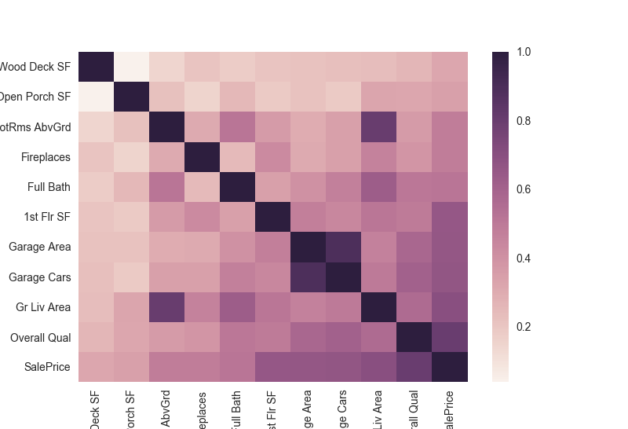

## General Thoughts on this section...

####  Interpreting the heat map...

* What were looking for here are points that stick out against the natural gradient.
* Notice that the following seem to fit this criteria:
  * Gr Liv Area & TotRms AbvGrd
    * __(Continuous):__ Above grade (ground) living area square feet *vs.* __(Discrete):__ Total rooms above grade (does not include bathrooms)
  * Garage Area & Garage Cars
    * __(Continuous):__ Size of garage in square feet *vs.* __(Discrete):__ Size of garage in car capacity
* If you read the descriptions of each it is logical that these columns have high magnitudes of colinearity
* The two features that are continuous will be kept as they will be much easier to work with