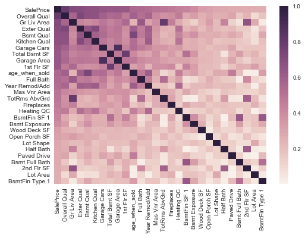
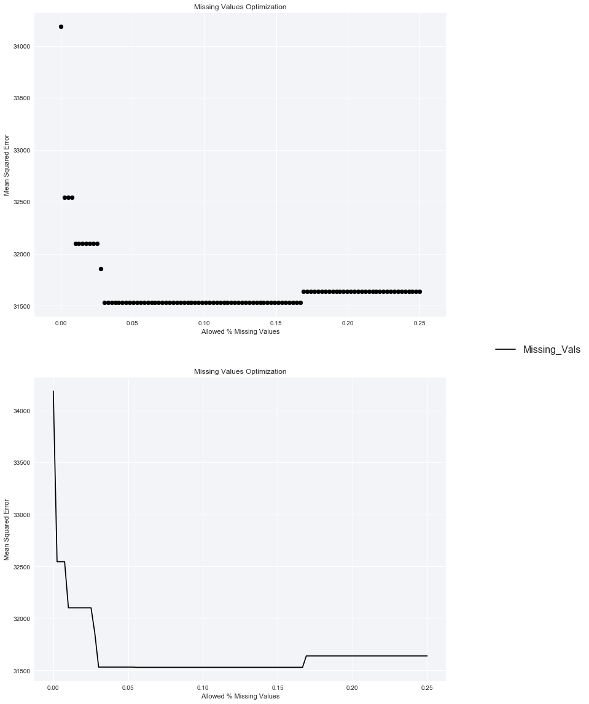
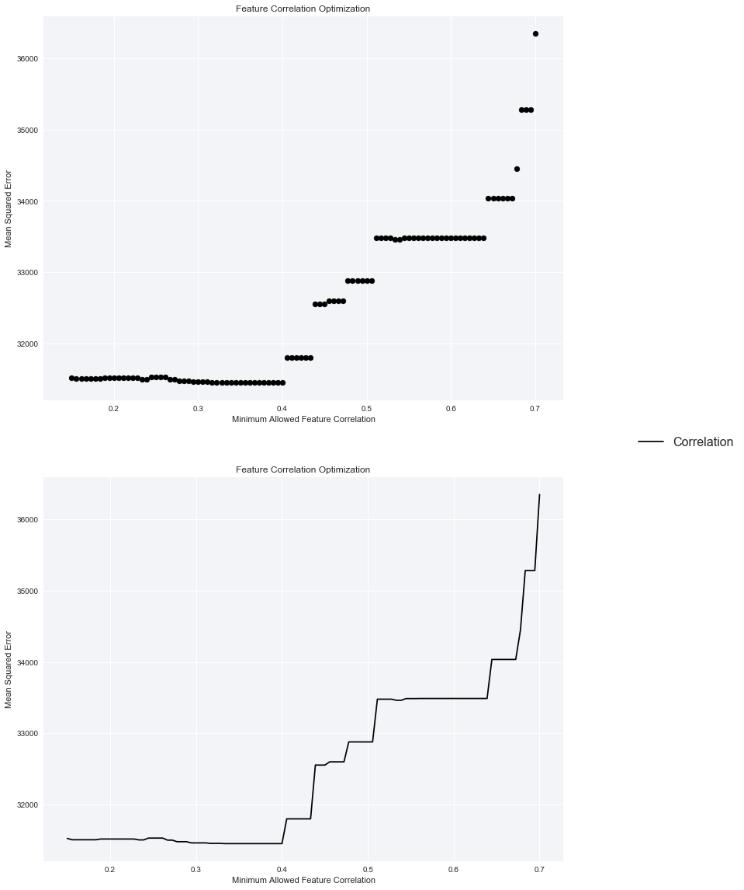
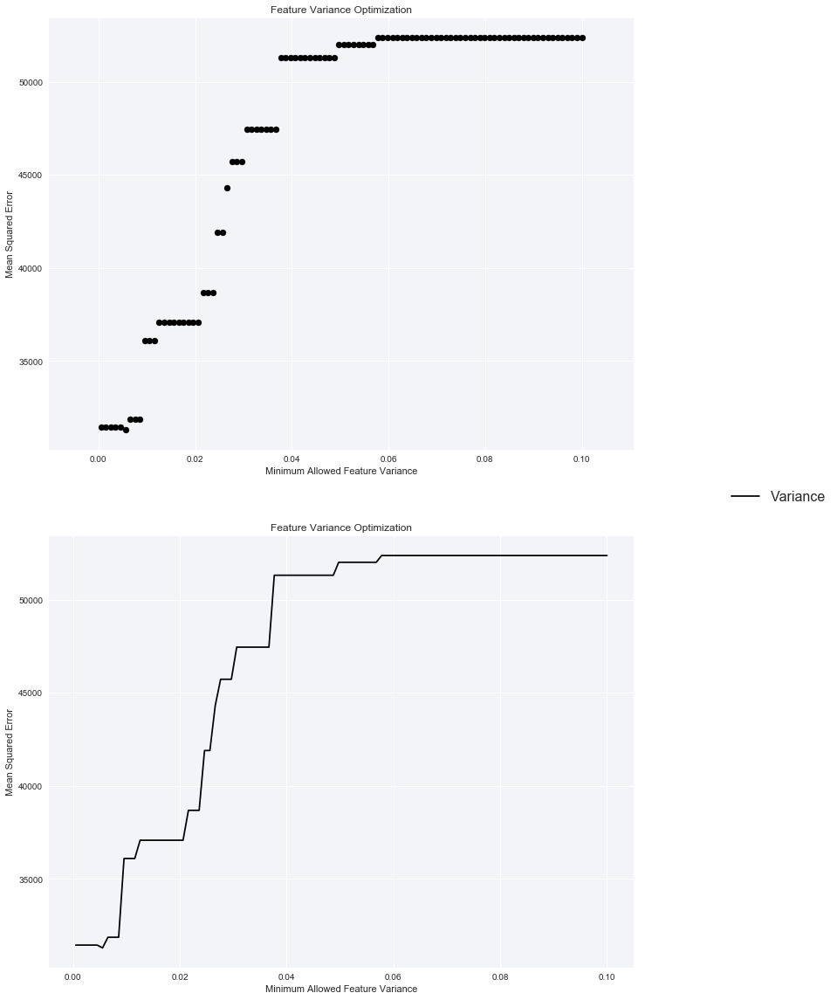
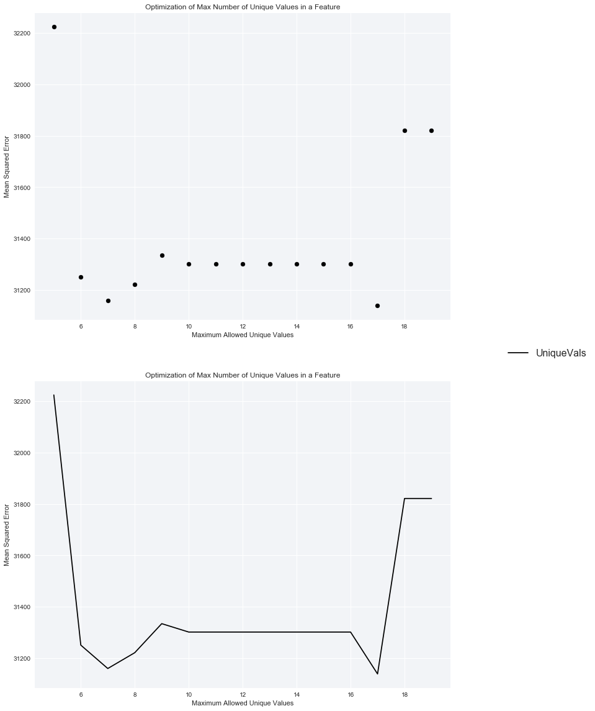
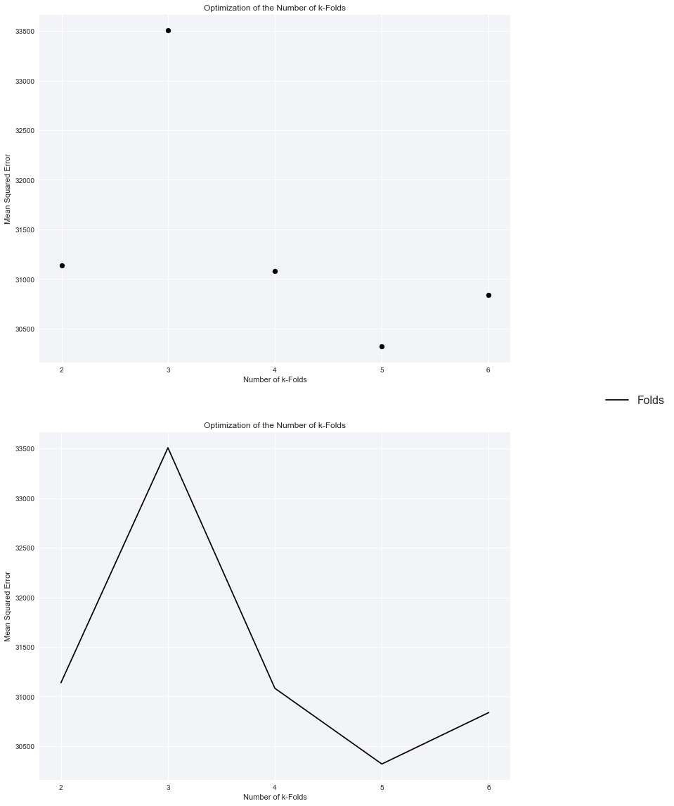

## Project Description
*  This project uses a linear regression model to predicted house sale prices.  
*  The data set is cleaned, and explored for intelligent feature engineering.  
*  A correlation to the target and colinearity is assessed for feature selection.  
*  Nominal text fields are converted into *“dummies”*.  
*  Then the model is trained using slkearn.linear_model LinearRegression with the selected features.
*  The hyper-parameters are parameterized for easy optimization which is done using k-folds validation.

## Introduction to the Data Set
*  Import pandas, matplotlib, and numpy into the environment. Import the classes you need from scikit-learn as well.
*  Read __AmesHousing.txt__ into a pandas data frame.
*  For the following functions, we recommend creating them in the first few cells in the notebook. This way, you can add cells to the end of the notebook to do experiments and update the functions in these cells.
  *  Create a function named __transform_features()__ that, for now, just returns the __train__ data frame.
  *  Create a function named __select_features()__ that, for now, just returns the __Gr Liv Area__ and __SalePrice__ columns from the __train__ data frame.
  *  Create a function named __train_and_test()__ that, for now:
    *  Selects the first __1460__ rows from from __data__ and assign to __train__.
    *  Selects the remaining rows from __data__ and assign to __test__.
    *  Trains a model using all numerical columns except the __SalePrice__ column (the target column) from the data frame returned from __select_features()__
    *  Tests the model on the test set using and returns the RMSE value.


```python
%matplotlib inline
import pandas as pd
import matplotlib.pyplot as plt
import matplotlib
import seaborn as sns
import numpy as np
from sklearn.linear_model import LinearRegression
from sklearn.metrics import mean_squared_error
from sklearn.model_selection import cross_val_score, KFold
```


```python
data = pd.read_csv('AmesHousing.txt', delimiter='\t')
```


```python
def transform_features(df):
    return df

def select_features():
    return ['Gr Liv Area'], 'SalePrice'

def train_and_test(df, train_features, target):
    train = df.iloc[:1460].copy()
    test = df.iloc[1460:].copy()
    lr = LinearRegression()
    lr.fit(train[train_features],train[target])
    predict = lr.predict(test[train_features])
    mse = mean_squared_error(test[target],predict)
    RMSE = np.sqrt(mse)
    
    return RMSE
```


```python
df_Initial = transform_features(data)
train_features_Initial, target_Initial = select_features()
RMSE_Initial = train_and_test(df_Initial, train_features_Initial, target_Initial)
RMSE_Initial
```


    57088.251612639091


## Feature Engineering
1. For all columns, drop any with 5% or more missing.  This will be revisited later.
1. For the text columns, drop any with 1 or more missing values, again this will be revisited later.
1. For the numerical columns, fill NaN with the following:
  *  If the column contains continuous data fill with the mean for that column.
  *  If the column contains nominal/categorical data then fill with the mode for that column.
1. What new features be created, that better capture the information in some of the features?
1. Drop columns that aren't useful for ML
1. Drop columns that leak info about the final sale.


```python
# Create a copy of the Data DataFrame
df = transform_features(data)
```


```python
# Convert Ordinal text values to integers
replace_ordinal_text_vals = {'Lot Shape': {'Reg':4,'IR1':3,'IR2':2,'IR3':1},
               'Utilities': {'AllPub':4,'NoSewr':3,'NoSeWa':2,'ELO':1},
               'Land Slope': {'Gtl':3,'Mod':2,'Sev':1},
               'Exter Qual': {'Ex':5,'Gd':4,'TA':3,'Fa':2,'Po':1},
               'Exter Cond': {'Ex':5,'Gd':4,'TA':3,'Fa':2,'Po':1},
               'Bsmt Qual': {'Ex':5,'Gd':4,'TA':3,'Fa':2,'Po':1,'NA':np.nan},
               'Bsmt Cond': {'Ex':5,'Gd':4,'TA':3,'Fa':2,'Po':1,'NA':np.nan},
               'Bsmt Exposure': {'Gd':4,'Av':3,'Mn':2,'No':1,'NA':np.nan},
               'BsmtFin Type 1': {'GLQ':6,'ALQ':5,'BLQ':3,'Rec':4,'LwQ':2,'Unf':1,'NA':np.nan},
               'BsmtFin Type 2': {'GLQ':6,'ALQ':5,'BLQ':3,'Rec':4,'LwQ':2,'Unf':1,'NA':np.nan},
               'Heating QC': {'Ex':5,'Gd':4,'TA':3,'Fa':2,'Po':1},
               'Electrical': {'SBrkr':5,'FuseA':4,'FuseF':3,'FuseP':2,'Mix':1},
               'Kitchen Qual': {'Ex':5,'Gd':4,'TA':3,'Fa':2,'Po':1},
               'Functional': {'Typ':8,'Min1':7,'Min2':6,'Mod':5,'Maj1':4,'Maj2':3,'Sev':2,'Sal':1},
               'Fireplace Qu': {'Ex':5,'Gd':4,'TA':3,'Fa':2,'Po':1,'NA':np.nan},
               'Garage Finish': {'Fin':3,'RFn':2,'Unf':1,'NA':np.nan},
               'Garage Qual': {'Ex':5,'Gd':4,'TA':3,'Fa':2,'Po':1,'NA':np.nan},
               'Garage Cond': {'Ex':5,'Gd':4,'TA':3,'Fa':2,'Po':1,'NA':np.nan},
               'Paved Drive': {'Y':3,'P':2,'N':1},
               'Pool QC': {'Ex':4,'Gd':3,'TA':2,'Fa':1,'NA':np.nan},
               'Fence': {'GdPrv':4,'MnPrv':3,'GdWo':2,'MnWw':1,'NA':np.nan}}
df = df.replace(replace_ordinal_text_vals)
df[list(replace_ordinal_text_vals.keys())]
```


<div>
<style>
    .dataframe thead tr:only-child th {
        text-align: right;
    }

    .dataframe thead th {
        text-align: left;
    }

    .dataframe tbody tr th {
        vertical-align: top;
    }
</style>
<table border="1" class="dataframe">
  <thead>
    <tr style="text-align: right;">
      <th></th>
      <th>Lot Shape</th>
      <th>Utilities</th>
      <th>Land Slope</th>
      <th>Exter Qual</th>
      <th>Exter Cond</th>
      <th>Bsmt Qual</th>
      <th>Bsmt Cond</th>
      <th>Bsmt Exposure</th>
      <th>BsmtFin Type 1</th>
      <th>BsmtFin Type 2</th>
      <th>...</th>
      <th>Electrical</th>
      <th>Kitchen Qual</th>
      <th>Functional</th>
      <th>Fireplace Qu</th>
      <th>Garage Finish</th>
      <th>Garage Qual</th>
      <th>Garage Cond</th>
      <th>Paved Drive</th>
      <th>Pool QC</th>
      <th>Fence</th>
    </tr>
  </thead>
  <tbody>
    <tr>
      <th>0</th>
      <td>3</td>
      <td>4</td>
      <td>3</td>
      <td>3</td>
      <td>3</td>
      <td>3.0</td>
      <td>4.0</td>
      <td>4.0</td>
      <td>3.0</td>
      <td>1.0</td>
      <td>...</td>
      <td>5.0</td>
      <td>3</td>
      <td>8</td>
      <td>4.0</td>
      <td>3.0</td>
      <td>3.0</td>
      <td>3.0</td>
      <td>2</td>
      <td>NaN</td>
      <td>NaN</td>
    </tr>
    <tr>
      <th>1</th>
      <td>4</td>
      <td>4</td>
      <td>3</td>
      <td>3</td>
      <td>3</td>
      <td>3.0</td>
      <td>3.0</td>
      <td>1.0</td>
      <td>4.0</td>
      <td>2.0</td>
      <td>...</td>
      <td>5.0</td>
      <td>3</td>
      <td>8</td>
      <td>NaN</td>
      <td>1.0</td>
      <td>3.0</td>
      <td>3.0</td>
      <td>3</td>
      <td>NaN</td>
      <td>3.0</td>
    </tr>
    <tr>
      <th>2</th>
      <td>3</td>
      <td>4</td>
      <td>3</td>
      <td>3</td>
      <td>3</td>
      <td>3.0</td>
      <td>3.0</td>
      <td>1.0</td>
      <td>5.0</td>
      <td>1.0</td>
      <td>...</td>
      <td>5.0</td>
      <td>4</td>
      <td>8</td>
      <td>NaN</td>
      <td>1.0</td>
      <td>3.0</td>
      <td>3.0</td>
      <td>3</td>
      <td>NaN</td>
      <td>NaN</td>
    </tr>
    <tr>
      <th>3</th>
      <td>4</td>
      <td>4</td>
      <td>3</td>
      <td>4</td>
      <td>3</td>
      <td>3.0</td>
      <td>3.0</td>
      <td>1.0</td>
      <td>5.0</td>
      <td>1.0</td>
      <td>...</td>
      <td>5.0</td>
      <td>5</td>
      <td>8</td>
      <td>3.0</td>
      <td>3.0</td>
      <td>3.0</td>
      <td>3.0</td>
      <td>3</td>
      <td>NaN</td>
      <td>NaN</td>
    </tr>
    <tr>
      <th>4</th>
      <td>3</td>
      <td>4</td>
      <td>3</td>
      <td>3</td>
      <td>3</td>
      <td>4.0</td>
      <td>3.0</td>
      <td>1.0</td>
      <td>6.0</td>
      <td>1.0</td>
      <td>...</td>
      <td>5.0</td>
      <td>3</td>
      <td>8</td>
      <td>3.0</td>
      <td>3.0</td>
      <td>3.0</td>
      <td>3.0</td>
      <td>3</td>
      <td>NaN</td>
      <td>3.0</td>
    </tr>
    <tr>
      <th>5</th>
      <td>3</td>
      <td>4</td>
      <td>3</td>
      <td>3</td>
      <td>3</td>
      <td>3.0</td>
      <td>3.0</td>
      <td>1.0</td>
      <td>6.0</td>
      <td>1.0</td>
      <td>...</td>
      <td>5.0</td>
      <td>4</td>
      <td>8</td>
      <td>4.0</td>
      <td>3.0</td>
      <td>3.0</td>
      <td>3.0</td>
      <td>3</td>
      <td>NaN</td>
      <td>NaN</td>
    </tr>
    <tr>
      <th>6</th>
      <td>4</td>
      <td>4</td>
      <td>3</td>
      <td>4</td>
      <td>3</td>
      <td>4.0</td>
      <td>3.0</td>
      <td>2.0</td>
      <td>6.0</td>
      <td>1.0</td>
      <td>...</td>
      <td>5.0</td>
      <td>4</td>
      <td>8</td>
      <td>NaN</td>
      <td>3.0</td>
      <td>3.0</td>
      <td>3.0</td>
      <td>3</td>
      <td>NaN</td>
      <td>NaN</td>
    </tr>
    <tr>
      <th>7</th>
      <td>3</td>
      <td>4</td>
      <td>3</td>
      <td>4</td>
      <td>3</td>
      <td>4.0</td>
      <td>3.0</td>
      <td>1.0</td>
      <td>5.0</td>
      <td>1.0</td>
      <td>...</td>
      <td>5.0</td>
      <td>4</td>
      <td>8</td>
      <td>NaN</td>
      <td>2.0</td>
      <td>3.0</td>
      <td>3.0</td>
      <td>3</td>
      <td>NaN</td>
      <td>NaN</td>
    </tr>
    <tr>
      <th>8</th>
      <td>3</td>
      <td>4</td>
      <td>3</td>
      <td>4</td>
      <td>3</td>
      <td>4.0</td>
      <td>3.0</td>
      <td>1.0</td>
      <td>6.0</td>
      <td>1.0</td>
      <td>...</td>
      <td>5.0</td>
      <td>4</td>
      <td>8</td>
      <td>3.0</td>
      <td>2.0</td>
      <td>3.0</td>
      <td>3.0</td>
      <td>3</td>
      <td>NaN</td>
      <td>NaN</td>
    </tr>
    <tr>
      <th>9</th>
      <td>4</td>
      <td>4</td>
      <td>3</td>
      <td>3</td>
      <td>3</td>
      <td>3.0</td>
      <td>3.0</td>
      <td>1.0</td>
      <td>1.0</td>
      <td>1.0</td>
      <td>...</td>
      <td>5.0</td>
      <td>4</td>
      <td>8</td>
      <td>3.0</td>
      <td>3.0</td>
      <td>3.0</td>
      <td>3.0</td>
      <td>3</td>
      <td>NaN</td>
      <td>NaN</td>
    </tr>
    <tr>
      <th>10</th>
      <td>3</td>
      <td>4</td>
      <td>3</td>
      <td>3</td>
      <td>3</td>
      <td>4.0</td>
      <td>3.0</td>
      <td>1.0</td>
      <td>1.0</td>
      <td>1.0</td>
      <td>...</td>
      <td>5.0</td>
      <td>3</td>
      <td>8</td>
      <td>3.0</td>
      <td>3.0</td>
      <td>3.0</td>
      <td>3.0</td>
      <td>3</td>
      <td>NaN</td>
      <td>NaN</td>
    </tr>
    <tr>
      <th>11</th>
      <td>3</td>
      <td>4</td>
      <td>3</td>
      <td>3</td>
      <td>4</td>
      <td>4.0</td>
      <td>3.0</td>
      <td>1.0</td>
      <td>5.0</td>
      <td>1.0</td>
      <td>...</td>
      <td>5.0</td>
      <td>3</td>
      <td>8</td>
      <td>NaN</td>
      <td>3.0</td>
      <td>3.0</td>
      <td>3.0</td>
      <td>3</td>
      <td>NaN</td>
      <td>4.0</td>
    </tr>
    <tr>
      <th>12</th>
      <td>3</td>
      <td>4</td>
      <td>3</td>
      <td>3</td>
      <td>3</td>
      <td>4.0</td>
      <td>3.0</td>
      <td>1.0</td>
      <td>1.0</td>
      <td>1.0</td>
      <td>...</td>
      <td>5.0</td>
      <td>3</td>
      <td>8</td>
      <td>4.0</td>
      <td>3.0</td>
      <td>3.0</td>
      <td>3.0</td>
      <td>3</td>
      <td>NaN</td>
      <td>NaN</td>
    </tr>
    <tr>
      <th>13</th>
      <td>4</td>
      <td>4</td>
      <td>3</td>
      <td>3</td>
      <td>3</td>
      <td>4.0</td>
      <td>3.0</td>
      <td>4.0</td>
      <td>6.0</td>
      <td>1.0</td>
      <td>...</td>
      <td>5.0</td>
      <td>4</td>
      <td>8</td>
      <td>1.0</td>
      <td>1.0</td>
      <td>3.0</td>
      <td>3.0</td>
      <td>3</td>
      <td>NaN</td>
      <td>NaN</td>
    </tr>
    <tr>
      <th>14</th>
      <td>3</td>
      <td>4</td>
      <td>3</td>
      <td>4</td>
      <td>3</td>
      <td>4.0</td>
      <td>3.0</td>
      <td>3.0</td>
      <td>6.0</td>
      <td>3.0</td>
      <td>...</td>
      <td>5.0</td>
      <td>4</td>
      <td>8</td>
      <td>NaN</td>
      <td>2.0</td>
      <td>3.0</td>
      <td>3.0</td>
      <td>3</td>
      <td>NaN</td>
      <td>NaN</td>
    </tr>
    <tr>
      <th>15</th>
      <td>2</td>
      <td>4</td>
      <td>2</td>
      <td>5</td>
      <td>3</td>
      <td>4.0</td>
      <td>3.0</td>
      <td>4.0</td>
      <td>5.0</td>
      <td>1.0</td>
      <td>...</td>
      <td>5.0</td>
      <td>5</td>
      <td>5</td>
      <td>4.0</td>
      <td>3.0</td>
      <td>3.0</td>
      <td>3.0</td>
      <td>3</td>
      <td>NaN</td>
      <td>NaN</td>
    </tr>
    <tr>
      <th>16</th>
      <td>3</td>
      <td>4</td>
      <td>2</td>
      <td>4</td>
      <td>3</td>
      <td>4.0</td>
      <td>3.0</td>
      <td>3.0</td>
      <td>6.0</td>
      <td>1.0</td>
      <td>...</td>
      <td>5.0</td>
      <td>3</td>
      <td>8</td>
      <td>NaN</td>
      <td>2.0</td>
      <td>3.0</td>
      <td>3.0</td>
      <td>3</td>
      <td>NaN</td>
      <td>NaN</td>
    </tr>
    <tr>
      <th>17</th>
      <td>4</td>
      <td>4</td>
      <td>3</td>
      <td>4</td>
      <td>3</td>
      <td>5.0</td>
      <td>3.0</td>
      <td>3.0</td>
      <td>6.0</td>
      <td>1.0</td>
      <td>...</td>
      <td>5.0</td>
      <td>5</td>
      <td>8</td>
      <td>5.0</td>
      <td>3.0</td>
      <td>3.0</td>
      <td>3.0</td>
      <td>3</td>
      <td>NaN</td>
      <td>NaN</td>
    </tr>
    <tr>
      <th>18</th>
      <td>4</td>
      <td>4</td>
      <td>3</td>
      <td>3</td>
      <td>3</td>
      <td>3.0</td>
      <td>3.0</td>
      <td>1.0</td>
      <td>2.0</td>
      <td>1.0</td>
      <td>...</td>
      <td>5.0</td>
      <td>3</td>
      <td>8</td>
      <td>NaN</td>
      <td>1.0</td>
      <td>3.0</td>
      <td>3.0</td>
      <td>3</td>
      <td>NaN</td>
      <td>NaN</td>
    </tr>
    <tr>
      <th>19</th>
      <td>4</td>
      <td>4</td>
      <td>3</td>
      <td>3</td>
      <td>3</td>
      <td>4.0</td>
      <td>3.0</td>
      <td>1.0</td>
      <td>5.0</td>
      <td>4.0</td>
      <td>...</td>
      <td>5.0</td>
      <td>3</td>
      <td>7</td>
      <td>3.0</td>
      <td>1.0</td>
      <td>3.0</td>
      <td>3.0</td>
      <td>3</td>
      <td>NaN</td>
      <td>3.0</td>
    </tr>
    <tr>
      <th>20</th>
      <td>3</td>
      <td>4</td>
      <td>3</td>
      <td>3</td>
      <td>3</td>
      <td>4.0</td>
      <td>3.0</td>
      <td>1.0</td>
      <td>3.0</td>
      <td>1.0</td>
      <td>...</td>
      <td>5.0</td>
      <td>3</td>
      <td>8</td>
      <td>3.0</td>
      <td>2.0</td>
      <td>3.0</td>
      <td>3.0</td>
      <td>3</td>
      <td>NaN</td>
      <td>3.0</td>
    </tr>
    <tr>
      <th>21</th>
      <td>4</td>
      <td>4</td>
      <td>3</td>
      <td>3</td>
      <td>3</td>
      <td>4.0</td>
      <td>3.0</td>
      <td>4.0</td>
      <td>6.0</td>
      <td>2.0</td>
      <td>...</td>
      <td>5.0</td>
      <td>4</td>
      <td>8</td>
      <td>3.0</td>
      <td>2.0</td>
      <td>3.0</td>
      <td>3.0</td>
      <td>3</td>
      <td>NaN</td>
      <td>3.0</td>
    </tr>
    <tr>
      <th>22</th>
      <td>4</td>
      <td>4</td>
      <td>3</td>
      <td>4</td>
      <td>3</td>
      <td>4.0</td>
      <td>3.0</td>
      <td>1.0</td>
      <td>6.0</td>
      <td>1.0</td>
      <td>...</td>
      <td>5.0</td>
      <td>4</td>
      <td>8</td>
      <td>NaN</td>
      <td>2.0</td>
      <td>3.0</td>
      <td>3.0</td>
      <td>3</td>
      <td>NaN</td>
      <td>NaN</td>
    </tr>
    <tr>
      <th>23</th>
      <td>3</td>
      <td>4</td>
      <td>3</td>
      <td>3</td>
      <td>3</td>
      <td>3.0</td>
      <td>3.0</td>
      <td>1.0</td>
      <td>5.0</td>
      <td>1.0</td>
      <td>...</td>
      <td>5.0</td>
      <td>3</td>
      <td>8</td>
      <td>3.0</td>
      <td>3.0</td>
      <td>3.0</td>
      <td>3.0</td>
      <td>3</td>
      <td>NaN</td>
      <td>NaN</td>
    </tr>
    <tr>
      <th>24</th>
      <td>3</td>
      <td>4</td>
      <td>3</td>
      <td>3</td>
      <td>3</td>
      <td>3.0</td>
      <td>3.0</td>
      <td>1.0</td>
      <td>6.0</td>
      <td>1.0</td>
      <td>...</td>
      <td>5.0</td>
      <td>3</td>
      <td>8</td>
      <td>2.0</td>
      <td>3.0</td>
      <td>3.0</td>
      <td>3.0</td>
      <td>3</td>
      <td>NaN</td>
      <td>NaN</td>
    </tr>
    <tr>
      <th>25</th>
      <td>4</td>
      <td>4</td>
      <td>3</td>
      <td>3</td>
      <td>3</td>
      <td>3.0</td>
      <td>3.0</td>
      <td>1.0</td>
      <td>3.0</td>
      <td>1.0</td>
      <td>...</td>
      <td>5.0</td>
      <td>3</td>
      <td>8</td>
      <td>2.0</td>
      <td>1.0</td>
      <td>3.0</td>
      <td>3.0</td>
      <td>3</td>
      <td>NaN</td>
      <td>NaN</td>
    </tr>
    <tr>
      <th>26</th>
      <td>4</td>
      <td>4</td>
      <td>3</td>
      <td>3</td>
      <td>3</td>
      <td>3.0</td>
      <td>3.0</td>
      <td>1.0</td>
      <td>5.0</td>
      <td>4.0</td>
      <td>...</td>
      <td>5.0</td>
      <td>3</td>
      <td>8</td>
      <td>NaN</td>
      <td>3.0</td>
      <td>3.0</td>
      <td>3.0</td>
      <td>3</td>
      <td>NaN</td>
      <td>3.0</td>
    </tr>
    <tr>
      <th>27</th>
      <td>4</td>
      <td>4</td>
      <td>3</td>
      <td>3</td>
      <td>3</td>
      <td>3.0</td>
      <td>3.0</td>
      <td>1.0</td>
      <td>5.0</td>
      <td>1.0</td>
      <td>...</td>
      <td>5.0</td>
      <td>3</td>
      <td>8</td>
      <td>1.0</td>
      <td>NaN</td>
      <td>NaN</td>
      <td>NaN</td>
      <td>3</td>
      <td>NaN</td>
      <td>NaN</td>
    </tr>
    <tr>
      <th>28</th>
      <td>3</td>
      <td>4</td>
      <td>3</td>
      <td>4</td>
      <td>3</td>
      <td>4.0</td>
      <td>3.0</td>
      <td>1.0</td>
      <td>6.0</td>
      <td>3.0</td>
      <td>...</td>
      <td>5.0</td>
      <td>4</td>
      <td>8</td>
      <td>2.0</td>
      <td>3.0</td>
      <td>3.0</td>
      <td>3.0</td>
      <td>3</td>
      <td>NaN</td>
      <td>NaN</td>
    </tr>
    <tr>
      <th>29</th>
      <td>4</td>
      <td>4</td>
      <td>3</td>
      <td>3</td>
      <td>3</td>
      <td>3.0</td>
      <td>3.0</td>
      <td>1.0</td>
      <td>4.0</td>
      <td>1.0</td>
      <td>...</td>
      <td>5.0</td>
      <td>3</td>
      <td>8</td>
      <td>NaN</td>
      <td>1.0</td>
      <td>3.0</td>
      <td>3.0</td>
      <td>3</td>
      <td>NaN</td>
      <td>NaN</td>
    </tr>
    <tr>
      <th>...</th>
      <td>...</td>
      <td>...</td>
      <td>...</td>
      <td>...</td>
      <td>...</td>
      <td>...</td>
      <td>...</td>
      <td>...</td>
      <td>...</td>
      <td>...</td>
      <td>...</td>
      <td>...</td>
      <td>...</td>
      <td>...</td>
      <td>...</td>
      <td>...</td>
      <td>...</td>
      <td>...</td>
      <td>...</td>
      <td>...</td>
      <td>...</td>
    </tr>
    <tr>
      <th>2900</th>
      <td>4</td>
      <td>4</td>
      <td>3</td>
      <td>4</td>
      <td>3</td>
      <td>5.0</td>
      <td>4.0</td>
      <td>3.0</td>
      <td>6.0</td>
      <td>1.0</td>
      <td>...</td>
      <td>5.0</td>
      <td>4</td>
      <td>8</td>
      <td>4.0</td>
      <td>3.0</td>
      <td>3.0</td>
      <td>3.0</td>
      <td>3</td>
      <td>NaN</td>
      <td>NaN</td>
    </tr>
    <tr>
      <th>2901</th>
      <td>4</td>
      <td>4</td>
      <td>3</td>
      <td>4</td>
      <td>3</td>
      <td>5.0</td>
      <td>3.0</td>
      <td>4.0</td>
      <td>6.0</td>
      <td>1.0</td>
      <td>...</td>
      <td>5.0</td>
      <td>4</td>
      <td>8</td>
      <td>4.0</td>
      <td>2.0</td>
      <td>3.0</td>
      <td>3.0</td>
      <td>3</td>
      <td>NaN</td>
      <td>NaN</td>
    </tr>
    <tr>
      <th>2902</th>
      <td>4</td>
      <td>4</td>
      <td>3</td>
      <td>5</td>
      <td>3</td>
      <td>4.0</td>
      <td>3.0</td>
      <td>4.0</td>
      <td>6.0</td>
      <td>1.0</td>
      <td>...</td>
      <td>5.0</td>
      <td>5</td>
      <td>8</td>
      <td>4.0</td>
      <td>3.0</td>
      <td>3.0</td>
      <td>3.0</td>
      <td>3</td>
      <td>NaN</td>
      <td>NaN</td>
    </tr>
    <tr>
      <th>2903</th>
      <td>4</td>
      <td>4</td>
      <td>3</td>
      <td>3</td>
      <td>2</td>
      <td>NaN</td>
      <td>NaN</td>
      <td>NaN</td>
      <td>NaN</td>
      <td>NaN</td>
      <td>...</td>
      <td>4.0</td>
      <td>3</td>
      <td>5</td>
      <td>NaN</td>
      <td>1.0</td>
      <td>2.0</td>
      <td>3.0</td>
      <td>1</td>
      <td>NaN</td>
      <td>NaN</td>
    </tr>
    <tr>
      <th>2904</th>
      <td>4</td>
      <td>4</td>
      <td>3</td>
      <td>3</td>
      <td>4</td>
      <td>4.0</td>
      <td>3.0</td>
      <td>4.0</td>
      <td>6.0</td>
      <td>1.0</td>
      <td>...</td>
      <td>5.0</td>
      <td>3</td>
      <td>8</td>
      <td>NaN</td>
      <td>3.0</td>
      <td>3.0</td>
      <td>3.0</td>
      <td>3</td>
      <td>NaN</td>
      <td>NaN</td>
    </tr>
    <tr>
      <th>2905</th>
      <td>4</td>
      <td>4</td>
      <td>3</td>
      <td>3</td>
      <td>3</td>
      <td>5.0</td>
      <td>3.0</td>
      <td>1.0</td>
      <td>6.0</td>
      <td>1.0</td>
      <td>...</td>
      <td>5.0</td>
      <td>3</td>
      <td>8</td>
      <td>NaN</td>
      <td>1.0</td>
      <td>3.0</td>
      <td>3.0</td>
      <td>3</td>
      <td>NaN</td>
      <td>NaN</td>
    </tr>
    <tr>
      <th>2906</th>
      <td>4</td>
      <td>4</td>
      <td>3</td>
      <td>3</td>
      <td>4</td>
      <td>5.0</td>
      <td>4.0</td>
      <td>1.0</td>
      <td>6.0</td>
      <td>1.0</td>
      <td>...</td>
      <td>5.0</td>
      <td>3</td>
      <td>8</td>
      <td>NaN</td>
      <td>3.0</td>
      <td>3.0</td>
      <td>3.0</td>
      <td>3</td>
      <td>NaN</td>
      <td>NaN</td>
    </tr>
    <tr>
      <th>2907</th>
      <td>4</td>
      <td>4</td>
      <td>3</td>
      <td>3</td>
      <td>3</td>
      <td>4.0</td>
      <td>3.0</td>
      <td>1.0</td>
      <td>1.0</td>
      <td>1.0</td>
      <td>...</td>
      <td>5.0</td>
      <td>3</td>
      <td>8</td>
      <td>NaN</td>
      <td>NaN</td>
      <td>NaN</td>
      <td>NaN</td>
      <td>3</td>
      <td>NaN</td>
      <td>NaN</td>
    </tr>
    <tr>
      <th>2908</th>
      <td>4</td>
      <td>4</td>
      <td>3</td>
      <td>3</td>
      <td>3</td>
      <td>4.0</td>
      <td>3.0</td>
      <td>2.0</td>
      <td>1.0</td>
      <td>1.0</td>
      <td>...</td>
      <td>5.0</td>
      <td>3</td>
      <td>8</td>
      <td>3.0</td>
      <td>2.0</td>
      <td>3.0</td>
      <td>3.0</td>
      <td>3</td>
      <td>NaN</td>
      <td>NaN</td>
    </tr>
    <tr>
      <th>2909</th>
      <td>4</td>
      <td>4</td>
      <td>3</td>
      <td>3</td>
      <td>3</td>
      <td>3.0</td>
      <td>3.0</td>
      <td>1.0</td>
      <td>5.0</td>
      <td>4.0</td>
      <td>...</td>
      <td>5.0</td>
      <td>3</td>
      <td>8</td>
      <td>3.0</td>
      <td>2.0</td>
      <td>3.0</td>
      <td>3.0</td>
      <td>3</td>
      <td>NaN</td>
      <td>NaN</td>
    </tr>
    <tr>
      <th>2910</th>
      <td>4</td>
      <td>4</td>
      <td>3</td>
      <td>3</td>
      <td>3</td>
      <td>4.0</td>
      <td>3.0</td>
      <td>1.0</td>
      <td>5.0</td>
      <td>1.0</td>
      <td>...</td>
      <td>5.0</td>
      <td>3</td>
      <td>4</td>
      <td>4.0</td>
      <td>3.0</td>
      <td>3.0</td>
      <td>3.0</td>
      <td>3</td>
      <td>NaN</td>
      <td>4.0</td>
    </tr>
    <tr>
      <th>2911</th>
      <td>3</td>
      <td>4</td>
      <td>3</td>
      <td>3</td>
      <td>3</td>
      <td>3.0</td>
      <td>3.0</td>
      <td>1.0</td>
      <td>5.0</td>
      <td>1.0</td>
      <td>...</td>
      <td>5.0</td>
      <td>3</td>
      <td>8</td>
      <td>NaN</td>
      <td>2.0</td>
      <td>3.0</td>
      <td>3.0</td>
      <td>3</td>
      <td>NaN</td>
      <td>NaN</td>
    </tr>
    <tr>
      <th>2912</th>
      <td>3</td>
      <td>4</td>
      <td>3</td>
      <td>3</td>
      <td>3</td>
      <td>3.0</td>
      <td>3.0</td>
      <td>1.0</td>
      <td>3.0</td>
      <td>1.0</td>
      <td>...</td>
      <td>5.0</td>
      <td>3</td>
      <td>8</td>
      <td>NaN</td>
      <td>1.0</td>
      <td>3.0</td>
      <td>3.0</td>
      <td>3</td>
      <td>NaN</td>
      <td>NaN</td>
    </tr>
    <tr>
      <th>2913</th>
      <td>4</td>
      <td>4</td>
      <td>3</td>
      <td>3</td>
      <td>3</td>
      <td>4.0</td>
      <td>3.0</td>
      <td>3.0</td>
      <td>6.0</td>
      <td>1.0</td>
      <td>...</td>
      <td>5.0</td>
      <td>3</td>
      <td>8</td>
      <td>NaN</td>
      <td>NaN</td>
      <td>NaN</td>
      <td>NaN</td>
      <td>3</td>
      <td>NaN</td>
      <td>NaN</td>
    </tr>
    <tr>
      <th>2914</th>
      <td>4</td>
      <td>4</td>
      <td>3</td>
      <td>3</td>
      <td>3</td>
      <td>3.0</td>
      <td>3.0</td>
      <td>1.0</td>
      <td>4.0</td>
      <td>1.0</td>
      <td>...</td>
      <td>5.0</td>
      <td>3</td>
      <td>8</td>
      <td>NaN</td>
      <td>1.0</td>
      <td>3.0</td>
      <td>2.0</td>
      <td>3</td>
      <td>NaN</td>
      <td>NaN</td>
    </tr>
    <tr>
      <th>2915</th>
      <td>4</td>
      <td>4</td>
      <td>2</td>
      <td>3</td>
      <td>3</td>
      <td>3.0</td>
      <td>3.0</td>
      <td>3.0</td>
      <td>4.0</td>
      <td>3.0</td>
      <td>...</td>
      <td>5.0</td>
      <td>3</td>
      <td>8</td>
      <td>3.0</td>
      <td>2.0</td>
      <td>3.0</td>
      <td>3.0</td>
      <td>3</td>
      <td>NaN</td>
      <td>NaN</td>
    </tr>
    <tr>
      <th>2916</th>
      <td>4</td>
      <td>4</td>
      <td>3</td>
      <td>3</td>
      <td>3</td>
      <td>4.0</td>
      <td>3.0</td>
      <td>3.0</td>
      <td>6.0</td>
      <td>1.0</td>
      <td>...</td>
      <td>5.0</td>
      <td>5</td>
      <td>8</td>
      <td>NaN</td>
      <td>NaN</td>
      <td>NaN</td>
      <td>NaN</td>
      <td>3</td>
      <td>NaN</td>
      <td>NaN</td>
    </tr>
    <tr>
      <th>2917</th>
      <td>4</td>
      <td>4</td>
      <td>3</td>
      <td>3</td>
      <td>3</td>
      <td>3.0</td>
      <td>3.0</td>
      <td>1.0</td>
      <td>4.0</td>
      <td>1.0</td>
      <td>...</td>
      <td>5.0</td>
      <td>3</td>
      <td>8</td>
      <td>NaN</td>
      <td>1.0</td>
      <td>3.0</td>
      <td>3.0</td>
      <td>3</td>
      <td>NaN</td>
      <td>NaN</td>
    </tr>
    <tr>
      <th>2918</th>
      <td>4</td>
      <td>4</td>
      <td>3</td>
      <td>3</td>
      <td>3</td>
      <td>3.0</td>
      <td>3.0</td>
      <td>1.0</td>
      <td>1.0</td>
      <td>1.0</td>
      <td>...</td>
      <td>5.0</td>
      <td>3</td>
      <td>8</td>
      <td>NaN</td>
      <td>NaN</td>
      <td>NaN</td>
      <td>NaN</td>
      <td>3</td>
      <td>NaN</td>
      <td>4.0</td>
    </tr>
    <tr>
      <th>2919</th>
      <td>4</td>
      <td>4</td>
      <td>3</td>
      <td>3</td>
      <td>3</td>
      <td>3.0</td>
      <td>3.0</td>
      <td>1.0</td>
      <td>1.0</td>
      <td>1.0</td>
      <td>...</td>
      <td>5.0</td>
      <td>3</td>
      <td>8</td>
      <td>NaN</td>
      <td>NaN</td>
      <td>NaN</td>
      <td>NaN</td>
      <td>3</td>
      <td>NaN</td>
      <td>NaN</td>
    </tr>
    <tr>
      <th>2920</th>
      <td>4</td>
      <td>4</td>
      <td>3</td>
      <td>3</td>
      <td>3</td>
      <td>3.0</td>
      <td>3.0</td>
      <td>1.0</td>
      <td>4.0</td>
      <td>1.0</td>
      <td>...</td>
      <td>5.0</td>
      <td>3</td>
      <td>8</td>
      <td>NaN</td>
      <td>1.0</td>
      <td>3.0</td>
      <td>3.0</td>
      <td>3</td>
      <td>NaN</td>
      <td>NaN</td>
    </tr>
    <tr>
      <th>2921</th>
      <td>3</td>
      <td>4</td>
      <td>3</td>
      <td>3</td>
      <td>3</td>
      <td>3.0</td>
      <td>3.0</td>
      <td>4.0</td>
      <td>4.0</td>
      <td>2.0</td>
      <td>...</td>
      <td>5.0</td>
      <td>3</td>
      <td>8</td>
      <td>NaN</td>
      <td>1.0</td>
      <td>3.0</td>
      <td>3.0</td>
      <td>3</td>
      <td>NaN</td>
      <td>NaN</td>
    </tr>
    <tr>
      <th>2922</th>
      <td>4</td>
      <td>4</td>
      <td>3</td>
      <td>3</td>
      <td>3</td>
      <td>3.0</td>
      <td>3.0</td>
      <td>1.0</td>
      <td>5.0</td>
      <td>1.0</td>
      <td>...</td>
      <td>5.0</td>
      <td>3</td>
      <td>8</td>
      <td>NaN</td>
      <td>1.0</td>
      <td>3.0</td>
      <td>3.0</td>
      <td>3</td>
      <td>NaN</td>
      <td>NaN</td>
    </tr>
    <tr>
      <th>2923</th>
      <td>4</td>
      <td>4</td>
      <td>2</td>
      <td>3</td>
      <td>3</td>
      <td>3.0</td>
      <td>3.0</td>
      <td>1.0</td>
      <td>5.0</td>
      <td>1.0</td>
      <td>...</td>
      <td>5.0</td>
      <td>3</td>
      <td>8</td>
      <td>4.0</td>
      <td>2.0</td>
      <td>3.0</td>
      <td>3.0</td>
      <td>2</td>
      <td>NaN</td>
      <td>NaN</td>
    </tr>
    <tr>
      <th>2924</th>
      <td>4</td>
      <td>4</td>
      <td>3</td>
      <td>3</td>
      <td>3</td>
      <td>3.0</td>
      <td>3.0</td>
      <td>1.0</td>
      <td>5.0</td>
      <td>1.0</td>
      <td>...</td>
      <td>5.0</td>
      <td>3</td>
      <td>8</td>
      <td>3.0</td>
      <td>1.0</td>
      <td>3.0</td>
      <td>3.0</td>
      <td>3</td>
      <td>NaN</td>
      <td>NaN</td>
    </tr>
    <tr>
      <th>2925</th>
      <td>3</td>
      <td>4</td>
      <td>3</td>
      <td>3</td>
      <td>3</td>
      <td>3.0</td>
      <td>3.0</td>
      <td>3.0</td>
      <td>6.0</td>
      <td>1.0</td>
      <td>...</td>
      <td>5.0</td>
      <td>3</td>
      <td>8</td>
      <td>NaN</td>
      <td>1.0</td>
      <td>3.0</td>
      <td>3.0</td>
      <td>3</td>
      <td>NaN</td>
      <td>4.0</td>
    </tr>
    <tr>
      <th>2926</th>
      <td>3</td>
      <td>4</td>
      <td>2</td>
      <td>3</td>
      <td>3</td>
      <td>4.0</td>
      <td>3.0</td>
      <td>3.0</td>
      <td>3.0</td>
      <td>5.0</td>
      <td>...</td>
      <td>5.0</td>
      <td>3</td>
      <td>8</td>
      <td>NaN</td>
      <td>1.0</td>
      <td>3.0</td>
      <td>3.0</td>
      <td>3</td>
      <td>NaN</td>
      <td>3.0</td>
    </tr>
    <tr>
      <th>2927</th>
      <td>4</td>
      <td>4</td>
      <td>3</td>
      <td>3</td>
      <td>3</td>
      <td>4.0</td>
      <td>3.0</td>
      <td>3.0</td>
      <td>6.0</td>
      <td>1.0</td>
      <td>...</td>
      <td>5.0</td>
      <td>3</td>
      <td>8</td>
      <td>NaN</td>
      <td>NaN</td>
      <td>NaN</td>
      <td>NaN</td>
      <td>3</td>
      <td>NaN</td>
      <td>3.0</td>
    </tr>
    <tr>
      <th>2928</th>
      <td>4</td>
      <td>4</td>
      <td>2</td>
      <td>3</td>
      <td>3</td>
      <td>4.0</td>
      <td>3.0</td>
      <td>3.0</td>
      <td>5.0</td>
      <td>2.0</td>
      <td>...</td>
      <td>5.0</td>
      <td>3</td>
      <td>8</td>
      <td>3.0</td>
      <td>2.0</td>
      <td>3.0</td>
      <td>3.0</td>
      <td>3</td>
      <td>NaN</td>
      <td>NaN</td>
    </tr>
    <tr>
      <th>2929</th>
      <td>4</td>
      <td>4</td>
      <td>2</td>
      <td>3</td>
      <td>3</td>
      <td>4.0</td>
      <td>3.0</td>
      <td>3.0</td>
      <td>2.0</td>
      <td>1.0</td>
      <td>...</td>
      <td>5.0</td>
      <td>3</td>
      <td>8</td>
      <td>3.0</td>
      <td>3.0</td>
      <td>3.0</td>
      <td>3.0</td>
      <td>3</td>
      <td>NaN</td>
      <td>NaN</td>
    </tr>
  </tbody>
</table>
<p>2930 rows × 21 columns</p>
</div>


```python
# Show all columns that have missing values and the quantity
missing = df.isnull().sum()
print(missing[missing>0])
```

    Lot Frontage       490
    Alley             2732
    Mas Vnr Type        23
    Mas Vnr Area        23
    Bsmt Qual           80
    Bsmt Cond           80
    Bsmt Exposure       83
    BsmtFin Type 1      80
    BsmtFin SF 1         1
    BsmtFin Type 2      81
    BsmtFin SF 2         1
    Bsmt Unf SF          1
    Total Bsmt SF        1
    Electrical           1
    Bsmt Full Bath       2
    Bsmt Half Bath       2
    Fireplace Qu      1422
    Garage Type        157
    Garage Yr Blt      159
    Garage Finish      159
    Garage Cars          1
    Garage Area          1
    Garage Qual        159
    Garage Cond        159
    Pool QC           2917
    Fence             2358
    Misc Feature      2824
    dtype: int64
    


```python
# Make a copy of the data DF and drop all columns that have %5 or more missing values.
percent_missing = df.isnull().sum()/len(df)
drop_missing_cols = percent_missing[percent_missing > 0.05].sort_values()
df = df.drop(drop_missing_cols.index, axis=1)
print('Dropped Columns Due to > 5.0% missing values')
drop_missing_cols
```

    Dropped Columns Due to > 5.0% missing values
    


    Garage Type      0.053584
    Garage Yr Blt    0.054266
    Garage Finish    0.054266
    Garage Qual      0.054266
    Garage Cond      0.054266
    Lot Frontage     0.167235
    Fireplace Qu     0.485324
    Fence            0.804778
    Alley            0.932423
    Misc Feature     0.963823
    Pool QC          0.995563
    dtype: float64


```python
# Drop all text columns that have any missing values
text_cols = df.select_dtypes(include=['object'])
missing_values = text_cols.isnull().sum()
drop_missing_cols = missing_values[missing_values > 0]
df = df.drop(drop_missing_cols.index, axis=1)
print('Dropped Text Columns Due to > 1 missing value')
drop_missing_cols
```

    Dropped Text Columns Due to > 1 missing value
    


    Mas Vnr Type    23
    dtype: int64


```python
# Determine the number of unique values & missing values for each numerical column
num_cols = df.select_dtypes(include=['int64', 'float64'])

uniq_values = [len(num_cols[col].unique()) for col in num_cols.columns]
uniq_num_series = pd.Series(data=uniq_values, index=num_cols.columns).sort_values(ascending=False)

missing_values = num_cols.isnull().sum()
uniq_num_df = pd.DataFrame()

uniq_num_df['Unique'] = uniq_num_series
uniq_num_df['Missing'] = missing_values

uniq_num_df
```


<div>
<style>
    .dataframe thead tr:only-child th {
        text-align: right;
    }

    .dataframe thead th {
        text-align: left;
    }

    .dataframe tbody tr th {
        vertical-align: top;
    }
</style>
<table border="1" class="dataframe">
  <thead>
    <tr style="text-align: right;">
      <th></th>
      <th>Unique</th>
      <th>Missing</th>
    </tr>
  </thead>
  <tbody>
    <tr>
      <th>Order</th>
      <td>2930</td>
      <td>0</td>
    </tr>
    <tr>
      <th>PID</th>
      <td>2930</td>
      <td>0</td>
    </tr>
    <tr>
      <th>Lot Area</th>
      <td>1960</td>
      <td>0</td>
    </tr>
    <tr>
      <th>Gr Liv Area</th>
      <td>1292</td>
      <td>0</td>
    </tr>
    <tr>
      <th>Bsmt Unf SF</th>
      <td>1138</td>
      <td>1</td>
    </tr>
    <tr>
      <th>1st Flr SF</th>
      <td>1083</td>
      <td>0</td>
    </tr>
    <tr>
      <th>Total Bsmt SF</th>
      <td>1059</td>
      <td>1</td>
    </tr>
    <tr>
      <th>SalePrice</th>
      <td>1032</td>
      <td>0</td>
    </tr>
    <tr>
      <th>BsmtFin SF 1</th>
      <td>996</td>
      <td>1</td>
    </tr>
    <tr>
      <th>2nd Flr SF</th>
      <td>635</td>
      <td>0</td>
    </tr>
    <tr>
      <th>Garage Area</th>
      <td>604</td>
      <td>1</td>
    </tr>
    <tr>
      <th>Mas Vnr Area</th>
      <td>446</td>
      <td>23</td>
    </tr>
    <tr>
      <th>Wood Deck SF</th>
      <td>380</td>
      <td>0</td>
    </tr>
    <tr>
      <th>BsmtFin SF 2</th>
      <td>275</td>
      <td>1</td>
    </tr>
    <tr>
      <th>Open Porch SF</th>
      <td>252</td>
      <td>0</td>
    </tr>
    <tr>
      <th>Enclosed Porch</th>
      <td>183</td>
      <td>0</td>
    </tr>
    <tr>
      <th>Screen Porch</th>
      <td>121</td>
      <td>0</td>
    </tr>
    <tr>
      <th>Year Built</th>
      <td>118</td>
      <td>0</td>
    </tr>
    <tr>
      <th>Year Remod/Add</th>
      <td>61</td>
      <td>0</td>
    </tr>
    <tr>
      <th>Misc Val</th>
      <td>38</td>
      <td>0</td>
    </tr>
    <tr>
      <th>Low Qual Fin SF</th>
      <td>36</td>
      <td>0</td>
    </tr>
    <tr>
      <th>3Ssn Porch</th>
      <td>31</td>
      <td>0</td>
    </tr>
    <tr>
      <th>MS SubClass</th>
      <td>16</td>
      <td>0</td>
    </tr>
    <tr>
      <th>Pool Area</th>
      <td>14</td>
      <td>0</td>
    </tr>
    <tr>
      <th>TotRms AbvGrd</th>
      <td>14</td>
      <td>0</td>
    </tr>
    <tr>
      <th>Mo Sold</th>
      <td>12</td>
      <td>0</td>
    </tr>
    <tr>
      <th>Overall Qual</th>
      <td>10</td>
      <td>0</td>
    </tr>
    <tr>
      <th>Overall Cond</th>
      <td>9</td>
      <td>0</td>
    </tr>
    <tr>
      <th>Bedroom AbvGr</th>
      <td>8</td>
      <td>0</td>
    </tr>
    <tr>
      <th>Functional</th>
      <td>8</td>
      <td>0</td>
    </tr>
    <tr>
      <th>BsmtFin Type 1</th>
      <td>7</td>
      <td>80</td>
    </tr>
    <tr>
      <th>Garage Cars</th>
      <td>7</td>
      <td>1</td>
    </tr>
    <tr>
      <th>BsmtFin Type 2</th>
      <td>7</td>
      <td>81</td>
    </tr>
    <tr>
      <th>Bsmt Cond</th>
      <td>6</td>
      <td>80</td>
    </tr>
    <tr>
      <th>Bsmt Qual</th>
      <td>6</td>
      <td>80</td>
    </tr>
    <tr>
      <th>Electrical</th>
      <td>6</td>
      <td>1</td>
    </tr>
    <tr>
      <th>Fireplaces</th>
      <td>5</td>
      <td>0</td>
    </tr>
    <tr>
      <th>Full Bath</th>
      <td>5</td>
      <td>0</td>
    </tr>
    <tr>
      <th>Yr Sold</th>
      <td>5</td>
      <td>0</td>
    </tr>
    <tr>
      <th>Kitchen Qual</th>
      <td>5</td>
      <td>0</td>
    </tr>
    <tr>
      <th>Heating QC</th>
      <td>5</td>
      <td>0</td>
    </tr>
    <tr>
      <th>Bsmt Exposure</th>
      <td>5</td>
      <td>83</td>
    </tr>
    <tr>
      <th>Exter Cond</th>
      <td>5</td>
      <td>0</td>
    </tr>
    <tr>
      <th>Bsmt Full Bath</th>
      <td>5</td>
      <td>2</td>
    </tr>
    <tr>
      <th>Kitchen AbvGr</th>
      <td>4</td>
      <td>0</td>
    </tr>
    <tr>
      <th>Exter Qual</th>
      <td>4</td>
      <td>0</td>
    </tr>
    <tr>
      <th>Lot Shape</th>
      <td>4</td>
      <td>0</td>
    </tr>
    <tr>
      <th>Bsmt Half Bath</th>
      <td>4</td>
      <td>2</td>
    </tr>
    <tr>
      <th>Land Slope</th>
      <td>3</td>
      <td>0</td>
    </tr>
    <tr>
      <th>Utilities</th>
      <td>3</td>
      <td>0</td>
    </tr>
    <tr>
      <th>Paved Drive</th>
      <td>3</td>
      <td>0</td>
    </tr>
    <tr>
      <th>Half Bath</th>
      <td>3</td>
      <td>0</td>
    </tr>
  </tbody>
</table>
</div>


```python
# Fill the numerical with the mode
num_cols = df.select_dtypes(include=['int64', 'float64'])
df[num_cols.columns] = df[num_cols.columns].fillna(df[num_cols.columns].mode().iloc[0])
```


```python
# Verify that the resulting DataFrame has no missing values
missing_values = df.isnull().sum()
print(missing_values[missing_values > 0])
```

    Series([], dtype: int64)
    


```python
# Create new features, that better captures the information.

# The 'Year Remod/Add' & 'Year Built' columns to calculate the years after the house
# was built until it was remodeled
years_until_remod = df['Year Remod/Add'] - df['Year Built']


# Similar to the above transformation... Yr Sold would provide better information if we altered it
# to the age of the house when sold.
age_when_sold = df['Yr Sold'] - df['Year Built']

# Check for negative values
print(years_until_remod[years_until_remod<0])
print(age_when_sold[age_when_sold<0])
```

    850   -1
    dtype: int64
    2180   -1
    dtype: int64
    


```python
# Add newly created features and remove rows with negative values
df['years_until_remod'] = years_until_remod
df['age_when_sold'] = age_when_sold
df = df.drop([850,2180], axis=0)

## No longer need original year columns
df = df.drop(['Yr Sold', 'Year Built'], axis=1)
```


```python
# Drop columns that aren't useful for ML
df = df.drop(['Order', 'PID'], axis=1)

# These columns have information that cannot be known 
# prior to the sale, as such they leak data.
df = df.drop(["Mo Sold", "Sale Condition", "Sale Type"], axis=1)
```


```python
# Review data
print(df.isnull().sum())
df.info()
```

    MS SubClass          0
    MS Zoning            0
    Lot Area             0
    Street               0
    Lot Shape            0
    Land Contour         0
    Utilities            0
    Lot Config           0
    Land Slope           0
    Neighborhood         0
    Condition 1          0
    Condition 2          0
    Bldg Type            0
    House Style          0
    Overall Qual         0
    Overall Cond         0
    Year Remod/Add       0
    Roof Style           0
    Roof Matl            0
    Exterior 1st         0
    Exterior 2nd         0
    Mas Vnr Area         0
    Exter Qual           0
    Exter Cond           0
    Foundation           0
    Bsmt Qual            0
    Bsmt Cond            0
    Bsmt Exposure        0
    BsmtFin Type 1       0
    BsmtFin SF 1         0
                        ..
    Heating QC           0
    Central Air          0
    Electrical           0
    1st Flr SF           0
    2nd Flr SF           0
    Low Qual Fin SF      0
    Gr Liv Area          0
    Bsmt Full Bath       0
    Bsmt Half Bath       0
    Full Bath            0
    Half Bath            0
    Bedroom AbvGr        0
    Kitchen AbvGr        0
    Kitchen Qual         0
    TotRms AbvGrd        0
    Functional           0
    Fireplaces           0
    Garage Cars          0
    Garage Area          0
    Paved Drive          0
    Wood Deck SF         0
    Open Porch SF        0
    Enclosed Porch       0
    3Ssn Porch           0
    Screen Porch         0
    Pool Area            0
    Misc Val             0
    SalePrice            0
    years_until_remod    0
    age_when_sold        0
    Length: 65, dtype: int64
    <class 'pandas.core.frame.DataFrame'>
    Int64Index: 2928 entries, 0 to 2929
    Data columns (total 65 columns):
    MS SubClass          2928 non-null int64
    MS Zoning            2928 non-null object
    Lot Area             2928 non-null int64
    Street               2928 non-null object
    Lot Shape            2928 non-null int64
    Land Contour         2928 non-null object
    Utilities            2928 non-null int64
    Lot Config           2928 non-null object
    Land Slope           2928 non-null int64
    Neighborhood         2928 non-null object
    Condition 1          2928 non-null object
    Condition 2          2928 non-null object
    Bldg Type            2928 non-null object
    House Style          2928 non-null object
    Overall Qual         2928 non-null int64
    Overall Cond         2928 non-null int64
    Year Remod/Add       2928 non-null int64
    Roof Style           2928 non-null object
    Roof Matl            2928 non-null object
    Exterior 1st         2928 non-null object
    Exterior 2nd         2928 non-null object
    Mas Vnr Area         2928 non-null float64
    Exter Qual           2928 non-null int64
    Exter Cond           2928 non-null int64
    Foundation           2928 non-null object
    Bsmt Qual            2928 non-null float64
    Bsmt Cond            2928 non-null float64
    Bsmt Exposure        2928 non-null float64
    BsmtFin Type 1       2928 non-null float64
    BsmtFin SF 1         2928 non-null float64
    BsmtFin Type 2       2928 non-null float64
    BsmtFin SF 2         2928 non-null float64
    Bsmt Unf SF          2928 non-null float64
    Total Bsmt SF        2928 non-null float64
    Heating              2928 non-null object
    Heating QC           2928 non-null int64
    Central Air          2928 non-null object
    Electrical           2928 non-null float64
    1st Flr SF           2928 non-null int64
    2nd Flr SF           2928 non-null int64
    Low Qual Fin SF      2928 non-null int64
    Gr Liv Area          2928 non-null int64
    Bsmt Full Bath       2928 non-null float64
    Bsmt Half Bath       2928 non-null float64
    Full Bath            2928 non-null int64
    Half Bath            2928 non-null int64
    Bedroom AbvGr        2928 non-null int64
    Kitchen AbvGr        2928 non-null int64
    Kitchen Qual         2928 non-null int64
    TotRms AbvGrd        2928 non-null int64
    Functional           2928 non-null int64
    Fireplaces           2928 non-null int64
    Garage Cars          2928 non-null float64
    Garage Area          2928 non-null float64
    Paved Drive          2928 non-null int64
    Wood Deck SF         2928 non-null int64
    Open Porch SF        2928 non-null int64
    Enclosed Porch       2928 non-null int64
    3Ssn Porch           2928 non-null int64
    Screen Porch         2928 non-null int64
    Pool Area            2928 non-null int64
    Misc Val             2928 non-null int64
    SalePrice            2928 non-null int64
    years_until_remod    2928 non-null int64
    age_when_sold        2928 non-null int64
    dtypes: float64(15), int64(34), object(16)
    memory usage: 1.5+ MB
    


```python
# Overwrite transform_features() so that it preforms the above feature engineering steps

def transform_features(df, missing_values_percent_threshold=0.05):
    # Convert Ordinal text values to integers
    replace_ordinal_text_vals = {'Lot Shape': {'Reg':4,'IR1':3,'IR2':2,'IR3':1},
                   'Utilities': {'AllPub':4,'NoSewr':3,'NoSeWa':2,'ELO':1},
                   'Land Slope': {'Gtl':3,'Mod':2,'Sev':1},
                   'Exter Qual': {'Ex':5,'Gd':4,'TA':3,'Fa':2,'Po':1},
                   'Exter Cond': {'Ex':5,'Gd':4,'TA':3,'Fa':2,'Po':1},
                   'Bsmt Qual': {'Ex':5,'Gd':4,'TA':3,'Fa':2,'Po':1,'NA':np.nan},
                   'Bsmt Cond': {'Ex':5,'Gd':4,'TA':3,'Fa':2,'Po':1,'NA':np.nan},
                   'Bsmt Exposure': {'Gd':4,'Av':3,'Mn':2,'No':1,'NA':np.nan},
                   'BsmtFin Type 1': {'GLQ':6,'ALQ':5,'BLQ':3,'Rec':4,'LwQ':2,'Unf':1,'NA':np.nan},
                   'BsmtFin Type 2': {'GLQ':6,'ALQ':5,'BLQ':3,'Rec':4,'LwQ':2,'Unf':1,'NA':np.nan},
                   'Heating QC': {'Ex':5,'Gd':4,'TA':3,'Fa':2,'Po':1},
                   'Electrical': {'SBrkr':5,'FuseA':4,'FuseF':3,'FuseP':2,'Mix':1},
                   'Kitchen Qual': {'Ex':5,'Gd':4,'TA':3,'Fa':2,'Po':1},
                   'Functional': {'Typ':8,'Min1':7,'Min2':6,'Mod':5,'Maj1':4,'Maj2':3,'Sev':2,'Sal':1},
                   'Fireplace Qu': {'Ex':5,'Gd':4,'TA':3,'Fa':2,'Po':1,'NA':np.nan},
                   'Garage Finish': {'Fin':3,'RFn':2,'Unf':1,'NA':np.nan},
                   'Garage Qual': {'Ex':5,'Gd':4,'TA':3,'Fa':2,'Po':1,'NA':np.nan},
                   'Garage Cond': {'Ex':5,'Gd':4,'TA':3,'Fa':2,'Po':1,'NA':np.nan},
                   'Paved Drive': {'Y':3,'P':2,'N':1},
                   'Pool QC': {'Ex':4,'Gd':3,'TA':2,'Fa':1,'NA':np.nan},
                   'Fence': {'GdPrv':4,'MnPrv':3,'GdWo':2,'MnWw':1,'NA':np.nan}}
    df = df.replace(replace_ordinal_text_vals)
    
    # Drop all columns that have missing values, then the threshold allows.
    percent_missing = df.isnull().sum()/len(df)
    drop_missing_cols = percent_missing[percent_missing > missing_values_percent_threshold].sort_values()
    df = df.drop(drop_missing_cols.index, axis=1)
    
    # Drop all text columns that have any missing values
    text_cols = df.select_dtypes(include=['object'])
    missing_values = text_cols.isnull().sum()
    drop_missing_cols = missing_values[missing_values > 0]
    df = df.drop(drop_missing_cols.index, axis=1)
    
    # Fill missing numerical data with mode
    num_cols = df.select_dtypes(include=['int64', 'float64'])
    df[num_cols.columns] = df[num_cols.columns].fillna(df[num_cols.columns].mode().iloc[0])
    
    # Create new features, that better captures the information.
    # The 'Year Remod/Add' & 'Year Built' columns to calculate the years after the house
    # was built until it was remodeled
    df['years_until_remod'] = df['Year Remod/Add'] - df['Year Built']
    # Similar to the above transformation... Yr Sold would provide better information if we altered it
    # to the age of the house when sold.
    df['age_when_sold'] = df['Yr Sold'] - df['Year Built']
    # Remove rows with negative values
    df = df.drop([850,2180], axis=0)
    # No longer need original year columns
    df = df.drop(['Yr Sold', 'Year Built'], axis=1)
    
    # Drop columns that aren't useful for ML
    df = df.drop(['Order', 'PID'], axis=1)

    # These columns have information that cannot be known 
    # prior to the sale, as such they leak data.
    df = df.drop(["Mo Sold", "Sale Condition", "Sale Type"], axis=1)
    
    # This column really should be text as it is listed as Nominal in the data description document
    df['MS SubClass'] = df['MS SubClass'].astype('object')
    
    return df
```


```python
# Quick Check that we get the same results as above
df = transform_features(data, missing_values_percent_threshold=0.05)
print(df.isnull().sum())
df.info()
```

    MS SubClass          0
    MS Zoning            0
    Lot Area             0
    Street               0
    Lot Shape            0
    Land Contour         0
    Utilities            0
    Lot Config           0
    Land Slope           0
    Neighborhood         0
    Condition 1          0
    Condition 2          0
    Bldg Type            0
    House Style          0
    Overall Qual         0
    Overall Cond         0
    Year Remod/Add       0
    Roof Style           0
    Roof Matl            0
    Exterior 1st         0
    Exterior 2nd         0
    Mas Vnr Area         0
    Exter Qual           0
    Exter Cond           0
    Foundation           0
    Bsmt Qual            0
    Bsmt Cond            0
    Bsmt Exposure        0
    BsmtFin Type 1       0
    BsmtFin SF 1         0
                        ..
    Heating QC           0
    Central Air          0
    Electrical           0
    1st Flr SF           0
    2nd Flr SF           0
    Low Qual Fin SF      0
    Gr Liv Area          0
    Bsmt Full Bath       0
    Bsmt Half Bath       0
    Full Bath            0
    Half Bath            0
    Bedroom AbvGr        0
    Kitchen AbvGr        0
    Kitchen Qual         0
    TotRms AbvGrd        0
    Functional           0
    Fireplaces           0
    Garage Cars          0
    Garage Area          0
    Paved Drive          0
    Wood Deck SF         0
    Open Porch SF        0
    Enclosed Porch       0
    3Ssn Porch           0
    Screen Porch         0
    Pool Area            0
    Misc Val             0
    SalePrice            0
    years_until_remod    0
    age_when_sold        0
    Length: 65, dtype: int64
    <class 'pandas.core.frame.DataFrame'>
    Int64Index: 2928 entries, 0 to 2929
    Data columns (total 65 columns):
    MS SubClass          2928 non-null object
    MS Zoning            2928 non-null object
    Lot Area             2928 non-null int64
    Street               2928 non-null object
    Lot Shape            2928 non-null int64
    Land Contour         2928 non-null object
    Utilities            2928 non-null int64
    Lot Config           2928 non-null object
    Land Slope           2928 non-null int64
    Neighborhood         2928 non-null object
    Condition 1          2928 non-null object
    Condition 2          2928 non-null object
    Bldg Type            2928 non-null object
    House Style          2928 non-null object
    Overall Qual         2928 non-null int64
    Overall Cond         2928 non-null int64
    Year Remod/Add       2928 non-null int64
    Roof Style           2928 non-null object
    Roof Matl            2928 non-null object
    Exterior 1st         2928 non-null object
    Exterior 2nd         2928 non-null object
    Mas Vnr Area         2928 non-null float64
    Exter Qual           2928 non-null int64
    Exter Cond           2928 non-null int64
    Foundation           2928 non-null object
    Bsmt Qual            2928 non-null float64
    Bsmt Cond            2928 non-null float64
    Bsmt Exposure        2928 non-null float64
    BsmtFin Type 1       2928 non-null float64
    BsmtFin SF 1         2928 non-null float64
    BsmtFin Type 2       2928 non-null float64
    BsmtFin SF 2         2928 non-null float64
    Bsmt Unf SF          2928 non-null float64
    Total Bsmt SF        2928 non-null float64
    Heating              2928 non-null object
    Heating QC           2928 non-null int64
    Central Air          2928 non-null object
    Electrical           2928 non-null float64
    1st Flr SF           2928 non-null int64
    2nd Flr SF           2928 non-null int64
    Low Qual Fin SF      2928 non-null int64
    Gr Liv Area          2928 non-null int64
    Bsmt Full Bath       2928 non-null float64
    Bsmt Half Bath       2928 non-null float64
    Full Bath            2928 non-null int64
    Half Bath            2928 non-null int64
    Bedroom AbvGr        2928 non-null int64
    Kitchen AbvGr        2928 non-null int64
    Kitchen Qual         2928 non-null int64
    TotRms AbvGrd        2928 non-null int64
    Functional           2928 non-null int64
    Fireplaces           2928 non-null int64
    Garage Cars          2928 non-null float64
    Garage Area          2928 non-null float64
    Paved Drive          2928 non-null int64
    Wood Deck SF         2928 non-null int64
    Open Porch SF        2928 non-null int64
    Enclosed Porch       2928 non-null int64
    3Ssn Porch           2928 non-null int64
    Screen Porch         2928 non-null int64
    Pool Area            2928 non-null int64
    Misc Val             2928 non-null int64
    SalePrice            2928 non-null int64
    years_until_remod    2928 non-null int64
    age_when_sold        2928 non-null int64
    dtypes: float64(15), int64(33), object(17)
    memory usage: 1.5+ MB
    

## Feature Selection
* Numerical Columns
  * Keep featues that have a correlation of 0.25 or better.
  * Of the remaining columns, check for colinearity and discard columns that exibit this behavior.
  * Columns with a low magnitue of variance \(<0.0015\) will be dropped
* Text columns
  * Creae dummy columns from the Nominal columns
    * Columns with many unique values will be to prevent excessive run time
* See the [documentation](DataDocumentation.txt) for a description of the data set.

#### Dealing with the numerical columns 1st


```python
# Determine the extent that each numerical training feature coorelates to the target (SalePrice).
corrmat = df.select_dtypes(include=['int64', 'float64']).corr()
sorted_corrs = corrmat['SalePrice'].abs().sort_values(ascending=False)
sorted_corrs
```


    SalePrice            1.000000
    Overall Qual         0.800279
    Gr Liv Area          0.712893
    Exter Qual           0.698883
    Bsmt Qual            0.679726
    Kitchen Qual         0.673466
    Garage Cars          0.648071
    Total Bsmt SF        0.641701
    Garage Area          0.641184
    1st Flr SF           0.632531
    age_when_sold        0.559042
    Full Bath            0.545641
    Year Remod/Add       0.533076
    Mas Vnr Area         0.505564
    TotRms AbvGrd        0.497966
    Fireplaces           0.475073
    Heating QC           0.450356
    BsmtFin SF 1         0.437732
    Bsmt Exposure        0.400176
    Wood Deck SF         0.327790
    Open Porch SF        0.315141
    Lot Shape            0.291420
    Half Bath            0.285217
    Paved Drive          0.275943
    Bsmt Full Bath       0.275820
    2nd Flr SF           0.269518
    Lot Area             0.267122
    BsmtFin Type 1       0.266487
    years_until_remod    0.240133
    Electrical           0.232594
    Bsmt Unf SF          0.183447
    Bsmt Cond            0.154896
    Bedroom AbvGr        0.143939
    Enclosed Porch       0.128756
    Functional           0.121810
    Kitchen AbvGr        0.119795
    Screen Porch         0.112187
    Overall Cond         0.101652
    Pool Area            0.068411
    Land Slope           0.066421
    Low Qual Fin SF      0.037649
    Bsmt Half Bath       0.035934
    3Ssn Porch           0.032236
    Utilities            0.026029
    Exter Cond           0.021839
    Misc Val             0.019295
    BsmtFin Type 2       0.016748
    BsmtFin SF 2         0.006050
    Name: SalePrice, dtype: float64


```python
# Determine the extent of colinearity for each numerical training feature
# Limit the check to features with a correlation to the SalePrice >= 0.25
strong_corrs = sorted_corrs[sorted_corrs >= 0.25]
corrmat = df[strong_corrs.index].corr().abs()
fig = plt.subplots()
plt.yticks(rotation=0) 
plt.xticks(rotation=90)
sns.heatmap(corrmat)
```


    <matplotlib.axes._subplots.AxesSubplot at 0x1abb6791a20>





#### Features with relatively strong colinearity
1. 1st Flr SF (Continuous) & Total Basmt SF (Continuous)
1. Gr Liv Area (Continuous) & Full Bath (Discrete)
1. Gr Liv Area (Continuous) & Half Bath (Discrete)
1. Gr Liv Area (Continuous) & TotRms AbvGrd (Discrete)
1. Garage Area (Continuous) & Garage Cars (Discrete)
1. TotRms AbvGrd (Discrete) & Full Bath (Discrete)
1. Bsmt Full Bath (Discrete) & BsmtFin SF1 (Continuous)
1. Half Bath (Discrete) & TotRms AbvGrd (Continuous)
1. 2nd Flr SF (Continuous) & Half Bath (Discrete)
1. 2nd Flr SF (Continuous) & TotRms AbvGrd (Discrete)
1. Gr Liv Area (Continuous) & 2nd Flr SF (Continuous)

#### To determine which features will be kept and which features will be dropped, the following set of criteria will be applied:
* Features that more strongly correlate with the target (SalePrice)
* Continuous data features will be favored


```python
colinearity_cols = ['2nd Flr SF', '1st Flr SF', 'Total Bsmt SF', 'Gr Liv Area', 'TotRms AbvGrd', 'Full Bath',
                    'Half Bath', 'Garage Area', 'Garage Cars', 'Bsmt Full Bath', 'BsmtFin SF 1']
sorted_corrs = corrmat['SalePrice'].abs()
sorted_corrs.loc[colinearity_cols].sort_values(ascending=False)
```


    Gr Liv Area       0.712893
    Garage Cars       0.648071
    Total Bsmt SF     0.641701
    Garage Area       0.641184
    1st Flr SF        0.632531
    Full Bath         0.545641
    TotRms AbvGrd     0.497966
    BsmtFin SF 1      0.437732
    Half Bath         0.285217
    Bsmt Full Bath    0.275820
    2nd Flr SF        0.269518
    Name: SalePrice, dtype: float64


#### Based upon the criteria listed above the following features will be kept or dropped.
* __Featues Kept__
  1. Total Bsmt SF
  1. Gr Liv Area
  1. Garage Area
  1. BsmtFin SF 1
* __Featues Dropped__
  1. 1st Flr SF
  1. TotRms AbvGrd
  1. Full Bath
  1. Half Bath
  1. Garage Cars
  1. Bsmt Full Bath
  1. 2nd Flr SF


```python
# Drop the columns due to colinearity
dropped_colinearity = ['1st Flr SF', 'TotRms AbvGrd', 'Full Bath', 
                       'Half Bath', 'Garage Cars', 'Bsmt Full Bath', '2nd Flr SF']
df = df.drop(dropped_colinearity, axis=1)
```


```python
# Display the variance for each numerical training feature
# Of the remaining features, a variance check will be done
# Those with low variance (<0.015) will be dropped

numerical = df.select_dtypes(include=['int64', 'float64'])

# Rescale the numerical columns
unit = (numerical - numerical.min()) / (numerical.max() - numerical.min())

# Verify rescaling worked
print('Max Values')
print(unit.max())
print('\nMin Values')
print(unit.min())

sorted_vars = unit.var().sort_values(ascending=False)
print('\n\nSorted Variance Values')
print(sorted_vars)

print('\nLow Variance Features')
sorted_vars[sorted_vars<0.0015]
```

    Max Values
    Lot Area             1.0
    Lot Shape            1.0
    Utilities            1.0
    Land Slope           1.0
    Overall Qual         1.0
    Overall Cond         1.0
    Year Remod/Add       1.0
    Mas Vnr Area         1.0
    Exter Qual           1.0
    Exter Cond           1.0
    Bsmt Qual            1.0
    Bsmt Cond            1.0
    Bsmt Exposure        1.0
    BsmtFin Type 1       1.0
    BsmtFin SF 1         1.0
    BsmtFin Type 2       1.0
    BsmtFin SF 2         1.0
    Bsmt Unf SF          1.0
    Total Bsmt SF        1.0
    Heating QC           1.0
    Electrical           1.0
    Low Qual Fin SF      1.0
    Gr Liv Area          1.0
    Bsmt Half Bath       1.0
    Bedroom AbvGr        1.0
    Kitchen AbvGr        1.0
    Kitchen Qual         1.0
    Functional           1.0
    Fireplaces           1.0
    Garage Area          1.0
    Paved Drive          1.0
    Wood Deck SF         1.0
    Open Porch SF        1.0
    Enclosed Porch       1.0
    3Ssn Porch           1.0
    Screen Porch         1.0
    Pool Area            1.0
    Misc Val             1.0
    SalePrice            1.0
    years_until_remod    1.0
    age_when_sold        1.0
    dtype: float64
    
    Min Values
    Lot Area             0.0
    Lot Shape            0.0
    Utilities            0.0
    Land Slope           0.0
    Overall Qual         0.0
    Overall Cond         0.0
    Year Remod/Add       0.0
    Mas Vnr Area         0.0
    Exter Qual           0.0
    Exter Cond           0.0
    Bsmt Qual            0.0
    Bsmt Cond            0.0
    Bsmt Exposure        0.0
    BsmtFin Type 1       0.0
    BsmtFin SF 1         0.0
    BsmtFin Type 2       0.0
    BsmtFin SF 2         0.0
    Bsmt Unf SF          0.0
    Total Bsmt SF        0.0
    Heating QC           0.0
    Electrical           0.0
    Low Qual Fin SF      0.0
    Gr Liv Area          0.0
    Bsmt Half Bath       0.0
    Bedroom AbvGr        0.0
    Kitchen AbvGr        0.0
    Kitchen Qual         0.0
    Functional           0.0
    Fireplaces           0.0
    Garage Area          0.0
    Paved Drive          0.0
    Wood Deck SF         0.0
    Open Porch SF        0.0
    Enclosed Porch       0.0
    3Ssn Porch           0.0
    Screen Porch         0.0
    Pool Area            0.0
    Misc Val             0.0
    SalePrice            0.0
    years_until_remod    0.0
    age_when_sold        0.0
    dtype: float64
    
    
    Sorted Variance Values
    BsmtFin Type 1       0.170651
    Bsmt Exposure        0.121236
    Year Remod/Add       0.120873
    Paved Drive          0.071973
    Heating QC           0.057377
    age_when_sold        0.049601
    Exter Qual           0.037333
    BsmtFin Type 2       0.037182
    Lot Shape            0.036134
    years_until_remod    0.035826
    Bsmt Unf SF          0.035401
    Bsmt Qual            0.030394
    Kitchen Qual         0.027453
    Fireplaces           0.026206
    Overall Qual         0.024529
    Garage Area          0.020854
    Overall Cond         0.019315
    Land Slope           0.015424
    Bsmt Half Bath       0.014962
    Mas Vnr Area         0.012305
    BsmtFin SF 2         0.012293
    SalePrice            0.011593
    Bedroom AbvGr        0.010709
    Screen Porch         0.009488
    Electrical           0.009436
    Functional           0.008978
    Gr Liv Area          0.008919
    Exter Cond           0.008641
    Open Porch SF        0.008159
    Wood Deck SF         0.007845
    BsmtFin SF 1         0.006377
    Bsmt Cond            0.005508
    Kitchen AbvGr        0.005095
    Total Bsmt SF        0.005061
    Enclosed Porch       0.004019
    3Ssn Porch           0.002451
    Pool Area            0.001981
    Low Qual Fin SF      0.001896
    Lot Area             0.001351
    Misc Val             0.000927
    Utilities            0.000512
    dtype: float64
    
    Low Variance Features
    


    Lot Area     0.001351
    Misc Val     0.000927
    Utilities    0.000512
    dtype: float64


#### Handling the text columns


```python
# Filter for text columns and determine the number of unique values
text_cols = df.select_dtypes(include=['object'])

uv = []
for col in text_cols.columns:
    uv.append(len(text_cols[col].unique()))
    
unique_vals = pd.Series(data=uv, index=text_cols.columns).sort_values(ascending=False)
unique_vals
```


    Neighborhood    28
    Exterior 2nd    17
    MS SubClass     16
    Exterior 1st    16
    Condition 1      9
    Roof Matl        8
    House Style      8
    Condition 2      8
    MS Zoning        7
    Foundation       6
    Roof Style       6
    Heating          6
    Bldg Type        5
    Lot Config       5
    Land Contour     4
    Street           2
    Central Air      2
    dtype: int64


```python
# For each nominal value do the following:
    # categorize the type
    # create dummy columns
    # append to the training df
    # remove the original column
    
for col in text_cols.columns:
    col_dummies = pd.get_dummies(df[col])
    df = pd.concat([df, col_dummies], axis=1)
    df = df.drop([col], axis=1)

df.columns
```


    Index([      'Lot Area',      'Lot Shape',      'Utilities',     'Land Slope',
             'Overall Qual',   'Overall Cond', 'Year Remod/Add',   'Mas Vnr Area',
               'Exter Qual',     'Exter Cond',
           ...
                    'Stone',           'Wood',          'Floor',           'GasA',
                     'GasW',           'Grav',           'OthW',           'Wall',
                        'N',              'Y'],
          dtype='object', length=194)


```python
# Overwrite transform_features() so that it preforms the above feature engineering steps
# parameterize the following thresholds: correlation, variance, & number of unique values

def select_features(df, min_correlation=0.25, min_variance=0.0015, max_unique_vals=10):
    # Save the target column in the event it is dropped
    target = 'SalePrice'
    target_col = df[target]
    
    # Drop the columns due to colinearity
    dropped_colinearity = ['1st Flr SF', 'TotRms AbvGrd', 'Full Bath', 
                       'Half Bath', 'Garage Cars', 'Bsmt Full Bath', '2nd Flr SF']
    # Verify that none of the colinear columns haven't already been removed from the df
    df_columns = df.columns.tolist()
    drop_cols = list(set(dropped_colinearity).intersection(df_columns))
    df = df.drop(drop_cols, axis=1)
    
    # Drop each column that fails the correlation threshold
    corrmat = df.select_dtypes(include=['int64', 'float64']).corr()
    corrs = corrmat[target].abs()
    weak_corrs = corrs[corrs < min_correlation]
    df = df.drop(weak_corrs.index, axis=1)
    
    # Drop each column that fails the variance threshold
    numerical = df.select_dtypes(include=['int64', 'float64'])
    rescaled = (numerical - numerical.min()) / (numerical.max() - numerical.min())
    var = rescaled.var()
    var_threshold = var[var < min_variance]
    df = df.drop(var_threshold.index, axis=1)
    
    # Drop each column that exceeds the unique_vals threshold
    # Otherwise categorize the type and generate dummy columns
    nominal_features = ["MS SubClass", "MS Zoning", "Street", "Land Contour", "Lot Config", "Neighborhood", 
                    "Condition 1", "Condition 2", "Bldg Type", "House Style", "Roof Style", "Roof Matl", "Exterior 1st", 
                    "Exterior 2nd", "Foundation", "Heating", "Central Air"]
    for col in nominal_features:
        if len(df[col].unique()) < max_unique_vals:
            df[col] = df[col].astype('category')
            col_dummies = pd.get_dummies(df[col])
            df = pd.concat([df, col_dummies], axis=1)
    df = df.drop(nominal_features, axis=1)        

    # Ensure the target column (SalePrice) isn't amonge the training features
    features = df.columns.tolist()
    while target in features:
        features.remove(target)
        
    # Check if the target column was dropped, if true then put it back
    if not target in df.columns:
        df[target] = target_col
            
    return features, target, df
```


```python
# Test select_features()
df = transform_features(data, missing_values_percent_threshold=0.05)
features, target, df = select_features(df, min_correlation=0.25, min_variance=0.0015, max_unique_vals=10)
for f in features:
    print(f)
```

    Lot Shape
    Overall Qual
    Year Remod/Add
    Mas Vnr Area
    Exter Qual
    Bsmt Qual
    Bsmt Exposure
    BsmtFin Type 1
    BsmtFin SF 1
    Total Bsmt SF
    Heating QC
    Gr Liv Area
    Kitchen Qual
    Fireplaces
    Garage Area
    Paved Drive
    Wood Deck SF
    Open Porch SF
    age_when_sold
    A (agr)
    C (all)
    FV
    I (all)
    RH
    RL
    RM
    Grvl
    Pave
    Bnk
    HLS
    Low
    Lvl
    Corner
    CulDSac
    FR2
    FR3
    Inside
    Artery
    Feedr
    Norm
    PosA
    PosN
    RRAe
    RRAn
    RRNe
    RRNn
    Artery
    Feedr
    Norm
    PosA
    PosN
    RRAe
    RRAn
    RRNn
    1Fam
    2fmCon
    Duplex
    Twnhs
    TwnhsE
    1.5Fin
    1.5Unf
    1Story
    2.5Fin
    2.5Unf
    2Story
    SFoyer
    SLvl
    Flat
    Gable
    Gambrel
    Hip
    Mansard
    Shed
    ClyTile
    CompShg
    Membran
    Metal
    Roll
    Tar&Grv
    WdShake
    WdShngl
    BrkTil
    CBlock
    PConc
    Slab
    Stone
    Wood
    Floor
    GasA
    GasW
    Grav
    OthW
    Wall
    N
    Y
    

## Optimize the Hyper Parameters Then Train & Test the Model


```python
def plot_RMSE_h_para_optimization(h_parameters, rmse_dict, title=" ", legend_h_offset = 1.35, 
    legend_v_offset=1.09, x_axis_label='Hyper Paremeter', default_x_ticks=True):
    
    # Generates both a scatter plot and a line plot from the data provided.  The rmse values will
        # be placed on the y-axis
    # Returns a pd.DataFrame: 
        # index = data_label
        # col_1 = minimum RMSE
        # col_2 = Corresponding h_parameter value
    
    # Parameter descriptions
        # data_labels: A list of each of the item(s) that are being evaluated.  T
            # Each list item will be a label on the resulting plot
        # h_parameters: A list of each of the h_parameter values, this list will generate the x-axis values
        # rmse_dict: 
            # Keys = Each of the item(s) that are being evaluated.  The key will be a 
                # label for the corresponding data set on the resulting plot and 
                # will be shown on the legend.
            # Values = A list of each of the y-axis values for the key.  Note, it must
                # have the same number of items as the h_parameters list.
        # title: The string value that will be used as both plot titles
        # legend_h_offset: The horizontal offset value for the legend
        # legend_v_offset: The vertical offset value for the legend
        # x_axis_label: The string value that will be placed on the x-axis
        # default_x_ticks: If set to False the h_parameters will be used to set_xticks
        
    matplotlib.rc('legend', fontsize=16)
    fig = plt.figure(figsize=(12,20))
    ax1 = fig.add_subplot(2,1,1)
    ax2 = fig.add_subplot(2,1,2)

    ax1.set_prop_cycle('color',plt.cm.spectral(np.linspace(0,1.3,21)))
    ax2.set_prop_cycle('color',plt.cm.spectral(np.linspace(0,1.3,21)))
    
    min_rmses = []
    optimal_h_parameters = []
    
    for data_label, rmse_values in rmse_dict.items():
        # add data series to scatter plot and line plot
        ax1.scatter(x=h_parameters, y=rmse_values, label=data_label)
        ax2.plot(h_parameters, rmse_values, label=data_label)
        
        # get min RMSE value and corresponding optimized hyper parameter
        index = rmse_values.index(min(rmse_values))
        min_rmses.append(rmse_values[index])
        optimal_h_parameters.append(h_parameters[index])

    ax1.set_xlabel(x_axis_label)
    ax1.set_ylabel('Mean Squared Error') 
    ax1.set_title(title)
    ax1.set_facecolor("#f2f4f7")

    ax2.legend(loc='center right', bbox_to_anchor=(legend_h_offset, legend_v_offset))
    ax2.set_xlabel(x_axis_label)
    ax2.set_ylabel('Mean Squared Error') 
    ax2.set_title(title)
    ax2.set_facecolor("#f2f4f7")
    
    if not default_x_ticks:
        ax1.set_xticks(h_parameters)
        ax2.set_xticks(h_parameters)
    
    plt.show()
    
    df_index = list(rmse_dict.keys())
    return pd.DataFrame(data={'min_rmse':min_rmses, 'optimal_h_parameter':optimal_h_parameters}, index=df_index)
    
def linear_reg_train_test_kfold_validation(df, train_columns, predict_column, folds=2):
    # Instantiate the k-Fold class
    kfolds = KFold(n_splits=folds, shuffle=True, random_state=1)
    
    # Instantiate the Linear Regression class
    lr = LinearRegression()
    
    # Use the cross_val_score() function to perform k-fold cross-validation
    # This will calculate our mean squared error for each fold.
    mses = cross_val_score(estimator=lr, X=df[train_columns], y=df[predict_column],
            scoring="neg_mean_squared_error", cv=kfolds)
    
    # Take the absolute value and square root of the mses to get Root Mean Squared Error (RMSE)
    mses_abs_sqrt = np.sqrt(np.absolute(mses))
    
    # Return the mean of all the RMSE values
    # for the k-fold cross validation of the model
    mean_rmse = np.mean(mses_abs_sqrt)
    return mean_rmse
```

### Missing Values Threshold Optimization
The *defaults* will be used for all other parameters:
* min_correlation = 0.25
* min_variance = 0.0015
* max_unique_vals = 10
* k-Folds = 2


```python
rmses = []
missing_values_allowed_percentage = np.linspace(0,0.25,100)
for percent in missing_values_allowed_percentage:
    df = transform_features(data, missing_values_percent_threshold=percent)
    features, target, df = select_features(df, min_correlation=0.25, min_variance=0.0015, max_unique_vals=10)
    rmses.append(linear_reg_train_test_kfold_validation(df, features, target, 2))
```


```python
rmse_dict = {'Missing_Vals': rmses}

plot_RMSE_h_para_optimization(missing_values_allowed_percentage, rmse_dict, title="Missing Values Optimization", 
    legend_h_offset = 1.35, legend_v_offset=1.09, x_axis_label='Allowed % Missing Values')
```





<div>
<style>
    .dataframe thead tr:only-child th {
        text-align: right;
    }

    .dataframe thead th {
        text-align: left;
    }

    .dataframe tbody tr th {
        vertical-align: top;
    }
</style>
<table border="1" class="dataframe">
  <thead>
    <tr style="text-align: right;">
      <th></th>
      <th>min_rmse</th>
      <th>optimal_h_parameter</th>
    </tr>
  </thead>
  <tbody>
    <tr>
      <th>Missing_Vals</th>
      <td>31530.028432</td>
      <td>0.055556</td>
    </tr>
  </tbody>
</table>
</div>


### Minimum Correlation Threshold Optimization
The previously determined optimal values will be used:
* Missing Values Threshold = 0.055556

The *defaults* will be used for all other parameters:
* min_variance = 0.0015
* max_unique_vals = 10
* k-Folds = 2


```python
starting_df = transform_features(data, missing_values_percent_threshold=0.055556)
```


```python
rmses = []
correlations = np.linspace(0.15,0.7,100)
for cor in correlations:
    features, target, df = select_features(starting_df, min_correlation=cor, min_variance=0.0015, max_unique_vals=10)
    rmses.append(linear_reg_train_test_kfold_validation(df, features, target, 2))
```


```python
rmse_dict = {'Correlation': rmses}

plot_RMSE_h_para_optimization(correlations, rmse_dict, title="Feature Correlation Optimization", 
    legend_h_offset = 1.35, legend_v_offset=1.09, x_axis_label='Minimum Allowed Feature Correlation')
```





<div>
<style>
    .dataframe thead tr:only-child th {
        text-align: right;
    }

    .dataframe thead th {
        text-align: left;
    }

    .dataframe tbody tr th {
        vertical-align: top;
    }
</style>
<table border="1" class="dataframe">
  <thead>
    <tr style="text-align: right;">
      <th></th>
      <th>min_rmse</th>
      <th>optimal_h_parameter</th>
    </tr>
  </thead>
  <tbody>
    <tr>
      <th>Correlation</th>
      <td>31452.365134</td>
      <td>0.333333</td>
    </tr>
  </tbody>
</table>
</div>


### Minimum Variance Threshold Optimization
The previously determined optimal values will be used:
* Missing Values Threshold = 0.055556
* Minimum Feature Correlation = 0.331313

The *defaults* will be used for all other parameters:
* max_unique_vals = 10
* k-Folds = 2


```python
rmses = []
varinaces = np.linspace(0.0005,0.1,100)
for var in varinaces:
    features, target, df = select_features(starting_df, min_correlation=0.331313, min_variance=var, max_unique_vals=10)
    rmses.append(linear_reg_train_test_kfold_validation(df, features, target, 2))
```


```python
rmse_dict = {'Variance': rmses}

plot_RMSE_h_para_optimization(varinaces, rmse_dict, title="Feature Variance Optimization", 
    legend_h_offset = 1.35, legend_v_offset=1.09, x_axis_label='Minimum Allowed Feature Variance')
```





<div>
<style>
    .dataframe thead tr:only-child th {
        text-align: right;
    }

    .dataframe thead th {
        text-align: left;
    }

    .dataframe tbody tr th {
        vertical-align: top;
    }
</style>
<table border="1" class="dataframe">
  <thead>
    <tr style="text-align: right;">
      <th></th>
      <th>min_rmse</th>
      <th>optimal_h_parameter</th>
    </tr>
  </thead>
  <tbody>
    <tr>
      <th>Variance</th>
      <td>31301.716635</td>
      <td>0.005525</td>
    </tr>
  </tbody>
</table>
</div>


### Maximum Unique Values Threshold Optimization
The previously determined optimal values will be used:
* Missing Values Threshold = 0.055556
* Minimum Feature Correlation = 0.331313
* Minimum Feature Variance = 0.005525

The *defaults* will be used for all other parameters:
* k-Folds = 2


```python
rmses = []
unique_vals = [v for v in range(5,20)]
for v in unique_vals:
    features, target, df = select_features(starting_df, min_correlation=0.331313, min_variance=0.005525, max_unique_vals=v)
    rmses.append(linear_reg_train_test_kfold_validation(df, features, target, 2))
```


```python
rmse_dict = {'UniqueVals': rmses}

plot_RMSE_h_para_optimization(unique_vals, rmse_dict, title="Optimization of Max Number of Unique Values in a Feature", 
    legend_h_offset = 1.35, legend_v_offset=1.09, x_axis_label='Maximum Allowed Unique Values')
```





<div>
<style>
    .dataframe thead tr:only-child th {
        text-align: right;
    }

    .dataframe thead th {
        text-align: left;
    }

    .dataframe tbody tr th {
        vertical-align: top;
    }
</style>
<table border="1" class="dataframe">
  <thead>
    <tr style="text-align: right;">
      <th></th>
      <th>min_rmse</th>
      <th>optimal_h_parameter</th>
    </tr>
  </thead>
  <tbody>
    <tr>
      <th>UniqueVals</th>
      <td>31138.658728</td>
      <td>17</td>
    </tr>
  </tbody>
</table>
</div>


### Number of k-Folds Optimization
The previously determined optimal values will be used:
* Missing Values Threshold = 0.055556
* Minimum Feature Correlation = 0.331313
* Minimum Feature Variance = 0.005525
* Maximum Unique Values = 17


```python
features, target, df = select_features(starting_df, min_correlation=0.331313, min_variance=0.005525, max_unique_vals=17)
```


```python
rmses = []
folds = [f for f in range(2,7)]
for f in folds:
    rmses.append(linear_reg_train_test_kfold_validation(df, features, target, f))
```


```python
rmse_dict = {'Folds': rmses}

plot_RMSE_h_para_optimization(folds, rmse_dict, title="Optimization of the Number of k-Folds", 
    legend_h_offset = 1.35, legend_v_offset=1.09, x_axis_label='Number of k-Folds', default_x_ticks=False)
```





<div>
<style>
    .dataframe thead tr:only-child th {
        text-align: right;
    }

    .dataframe thead th {
        text-align: left;
    }

    .dataframe tbody tr th {
        vertical-align: top;
    }
</style>
<table border="1" class="dataframe">
  <thead>
    <tr style="text-align: right;">
      <th></th>
      <th>min_rmse</th>
      <th>optimal_h_parameter</th>
    </tr>
  </thead>
  <tbody>
    <tr>
      <th>Folds</th>
      <td>30318.821483</td>
      <td>5</td>
    </tr>
  </tbody>
</table>
</div>


